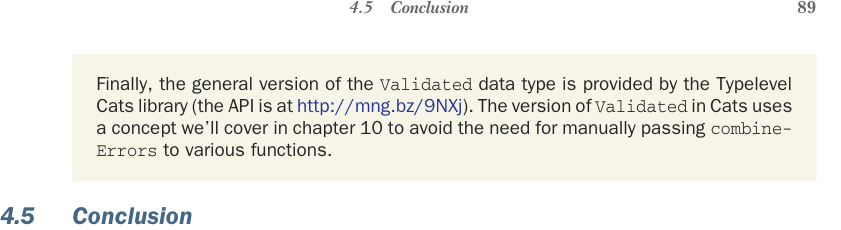

# Page 0118

[<- Page 0117](./page-0117) | [Pages index](./) | [Page 0119 ->](./page-0119)

> Part 1: Introduction to functional programming / Chapter 4: Handling errors without exceptions / 4.5 Conclusion

## 89 4.5 Conclusion

Finally, the general version of the `Validated` data type is provided by the Typelevel Cats library (the API is at http://mng.bz/9NXj). The version of `Validated` in Cats uses a concept we’ll cover in chapter 10 to avoid the need for manually passing `combine-` `Errors` to various functions.

### 4.5 Conclusion

In this chapter, we noted some of the problems with using exceptions and introduced the basic principles of purely functional error handling. Although we focused on the algebraic data types `Option` and `Either`, the bigger idea is that we can represent exceptions as ordinary values and use higher-order functions to encapsulate common patterns of handling and propagating errors. This general idea, of representing effects as values, is something we’ll see again and again throughout this book in various guises. We don’t expect you to be fluent with all the higher-order functions we wrote in this chapter, but you should now have enough familiarity to get started writing your own functional code complete with error handling. With these new tools in hand, exceptions should be reserved only for truly unrecoverable conditions. Lastly, in this chapter we touched briefly on the notion of a nonstrict function (recall the functions `orElse`, `getOrElse`, and `catchNonFatal`). In the next chapter, we’ll look more closely at why nonstrictness is important and how it can buy us greater modularity and efficiency in our functional programs.

### Summary

Throwing exceptions is a side effect because doing so breaks referential transparency.

Throwing exceptions inhibits local reasoning because program meaning changes depending on which `try` block a throw is nested in.

Exceptions are not type safe; the potential for an error occurring is not communicated in the type of the function, leading to unhandled exceptions becoming runtime errors.

Instead of exceptions, we can model errors as values.

Rather than modeling error values as return codes, we use various ADTs that describe success and failure.

The `Option` type has two data constructors, `Some(a)` and `None`, which are used to model a successful result and an error. No details are provided about the error.

The `Either` type has two data constructors, `Left(e)` and `Right(a)`, which are used to model an error and a successful result. The `Either` type is similar to `Option`, except it provides details about the error.

[<- Page 0117](./page-0117) | [Pages index](./) | [Page 0119 ->](./page-0119)
