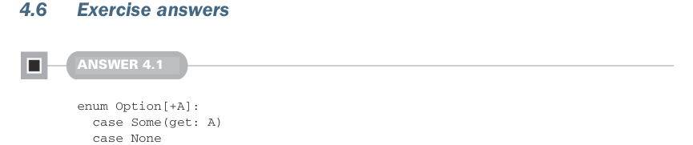
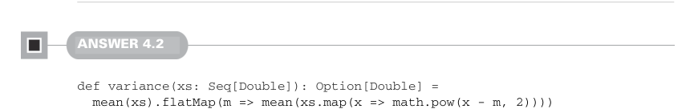

# Page 0119

[<- Page 0118](./page-0118) | [Pages index](./) | [Page 0120 ->](./page-0120)

> Part 1: Introduction to functional programming / Chapter 4: Handling errors without exceptions / 4.6 Exercise answers

The `Try` type is like `Either`, except errors are represented as `Throwable` values instead of arbitrary types. By constraining errors to be subtypes of `Throwable`, the `Try` type is able to provide various convenience operations for code that throws exceptions.

The `Validated` type is like `Either`, except errors are accumulated when combining multiple failed computations.

Higher-order functions, like `map` and `flatMap`, let us work with potentially failed computations without explicitly handling an error from every function call. These higher-order functions are defined for each of the various error-handling data types.



### 4.6 Exercise answers

#### ANSWER 4.1

```scala
enum Option[+A]:
case Some(get: A)
case None
def map[B](f: A => B): Option[B] = this match
case None => None
case Some(a) => Some(f(a))
def getOrElse[B>:A](default: => B): B = this match
case None => default
case Some(a) => a
def flatMap[B](f: A => Option[B]): Option[B] =
map(f).getOrElse(None)
def orElse[B>:A](ob: => Option[B]): Option[B] =
map(Some(_)).getOrElse(ob)
def filter(f: A => Boolean): Option[A] =
flatMap(a => if f(a) then Some(a) else None)
```

The `map` and `getOrElse` methods are each implemented by pattern matching on `this` and defining behavior for each data constructor. The `flatMap` and `orElse` methods are both implemented by creating nested options and then using `getOrElse` to remove the outer layer. Finally, `filter` is implemented via `flatMap` in the same way we implemented it for `List`.



#### ANSWER 4.2

```scala
def variance(xs: Seq[Double]): Option[Double] =
mean(xs).flatMap(m => mean(xs.map(x => math.pow(x - m, 2))))
```

[<- Page 0118](./page-0118) | [Pages index](./) | [Page 0120 ->](./page-0120)
