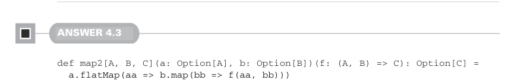
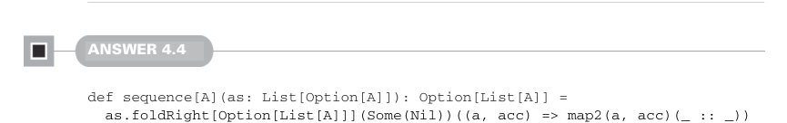
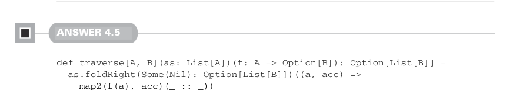

# Page 0120

[<- Page 0119](./page-0119) | [Pages index](./) | [Page 0121 ->](./page-0121)

> Part 1: Introduction to functional programming / Chapter 4: Handling errors without exceptions / 4.6 Exercise answers

## 91 4.6 Exercise answers

We first take the mean of the original samples, which results in an `Option[Double]`. We call `flatMap` on that, passing an anonymous function of type `Double` `=>` `Option[Double]`. In the definition of this anonymous function, we map over the original samples, transforming each element `x` to `math.pow(x` `-` `m,` `2)`, and we then take the `mean` of that transformed sequence. Note that the inner call to `mean` returns an `Option[Double]`, which is why we needed to `flatMap` the result of the outer `mean`. Had we used `map` instead, we’d have ended up with an `Option[Option[Double]]`.



#### ANSWER 4.3

```scala
def map2[A, B, C](a: Option[A], b: Option[B])(f: (A, B) => C): Option[C] =
a.flatMap(aa => b.map(bb => f(aa, bb)))
```

This implementation uses `flatMap` on the first option and `map` on the second option. If we had used `map` on both options, we would have ended up with an `Option[Option[C]]`, which we’d then need to reduce via `getOrElse(None)`, but `map(g).getOrElse(None)` is the definition of `flatMap`. Alternatively, we could have used pattern matching:

```scala
def map2[A, B, C](a: Option[A], b: Option[B])(f: (A, B) => C): Option[C] =
(a, b) match
case (Some(aa), Some(bb)) => Some(f(aa, bb))
case _ => None
```



#### ANSWER 4.4

```scala
def sequence[A](as: List[Option[A]]): Option[List[A]] =
as.foldRight[Option[List[A]]](Some(Nil))((a, acc) => map2(a, acc)(_ :: _))
```

We right fold the list of options, using `map2`, with list cons as our combining function. Note we’re using the standard library version of `List` here, which uses different names than the data type we previously created. In particular, `::` takes the place of `Cons`; `h` `::` `t` is the standard library equivalent of `Cons(h,` `t)` from chapter 3.



#### ANSWER 4.5

```scala
def traverse[A, B](as: List[A])(f: A => Option[B]): Option[List[B]] =
as.foldRight(Some(Nil): Option[List[B]])((a, acc) =>
map2(f(a), acc)(_ :: _))
```

We use the same strategy for `traverse` as we did for our initial implementation of `sequence`: a right fold over the list elements, with `map2` and `::` as the combining

[<- Page 0119](./page-0119) | [Pages index](./) | [Page 0121 ->](./page-0121)
