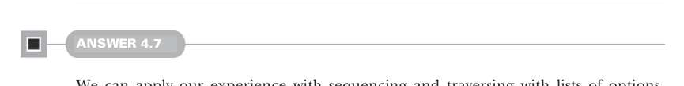

# Page 0121

[<- Page 0120](./page-0120) | [Pages index](./) | [Page 0122 ->](./page-0122)

> Part 1: Introduction to functional programming / Chapter 4: Handling errors without exceptions / 4.6 Exercise answers

function. The only difference is that we apply each element to `f` before calling `map2`. To implement `sequence`, we pass the identity function to `traverse` since each element in our input list is already an option:

```scala
def sequence[A](as: List[Option[A]]): Option[List[A]] =
traverse(as)(a => a)
```


#### ANSWER 4.6

```scala
enum Either[+E, +A]:
case Left(value: E)
case Right(value: A)
def map[B](f: A => B): Either[E, B] = this match
case Right(value) => Right(f(value))
case Left(value) => Left(value)
def flatMap[EE >: E, B](f: A => Either[EE, B]): Either[EE, B] =
this match
case Right(value) => f(value)
case Left(value) => Left(value)
def orElse[EE >: E,B >: A](b: => Either[EE, B]): Either[EE, B] =
this match
case Right(value) => Right(value)
case Left(_) => b
def map2[EE >: E, B, C](that: Either[EE, B])(
f: (A, B) => C
): Either[EE, C] =
for
a <- this
b <- that
yield f(a, b)
```

The `map`, `flatMap`, and `orElse` operations are implemented using pattern matching. The `map2` operation is implemented using a for-comprehension, which expands to `flatMap(a` `=>` `that.map(b` `=>` `f(a,` `b)))`.



#### ANSWER 4.7

We can apply our experience with sequencing and traversing with lists of options, changing the definitions slightly:

[<- Page 0120](./page-0120) | [Pages index](./) | [Page 0122 ->](./page-0122)
