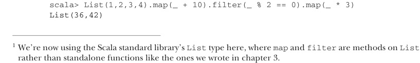

# Page 0123

[<- Page 0122](./page-0122) | [Pages index](./) | [Page 0124 ->](./page-0124)

> Part 1: Introduction to functional programming / Chapter 5: Strictness and laziness


## Strictness and laziness

### This chapter covers

Contrasting strictness and nonstrictness

Introducing lazy lists

Separating program description from evaluation

In chapter 3, we talked about purely functional data structures, using singly linked lists as an example. We covered a number of bulk operations on lists: `map`, `filter`, `foldLeft`, `foldRight`, `zipWith`, and so on. We noted that each of these operations makes its own pass over the input and constructs a fresh list for the output. Imagine you had a deck of cards and were asked to remove the odd-numbered cards and then flip over all the queens. Ideally, you’d make a single pass through the deck, looking for queens and odd-numbered cards at the same time. This is more efficient than removing the odd cards and then looking for queens in the remainder—and yet the latter is what Scala is doing. Consider the following code:1



```scala
scala> List(1,2,3,4).map(_ + 10).filter(_ % 2 == 0).map(_ * 3)
List(36,42)
```

1 We’re now using the Scala standard library’s `List` type here, where `map` and `filter` are methods on `List` rather than standalone functions like the ones we wrote in chapter 3.

**94**

[<- Page 0122](./page-0122) | [Pages index](./) | [Page 0124 ->](./page-0124)
