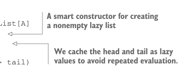

# Page 0127

[<- Page 0126](./page-0126) | [Pages index](./) | [Page 0128 ->](./page-0128)

> Part 1: Introduction to functional programming / Chapter 5: Strictness and laziness / 5.2 Lazy lists: An extended example

will be computed twice as well. We can cache the value explicitly if we wish to only evaluate the result once by using the `lazy` keyword:

```scala
scala> def maybeTwice2(b: Boolean, i: => Int) =
|
lazy val j = i
|
if b then j + j else 0
maybeTwice: (b: Boolean, i: => Int)Int
scala> val x = maybeTwice2(true, { println("hi"); 1 + 41 })
hi
x: Int = 84
```

Adding the `lazy` keyword to a `val` declaration will cause Scala to delay evaluation of the right-hand side of that `lazy` `val` declaration until its first reference during evaluation of another expression. It will also cache the result so subsequent references to it don’t trigger repeated evaluation.


Formal definition of strictness If the evaluation of an expression runs forever or throws an error instead of returning a definite value, we say the expression doesn’t *terminate* or it evaluates to *bottom*. A function `f` is *strict* if the expression `f(x)` evaluates to bottom for all `x` that evaluate to bottom.

As a final bit of terminology, we say a nonstrict function in Scala takes its arguments by *name* rather than by *value*.

### 5.2 Lazy lists: An extended example

Let’s now return to the problem posed at the beginning of this chapter. We’ll explore how laziness can be used to improve the efficiency and modularity of functional programs, using *lazy lists* as an example. We’ll see how chains of transformations on lazy lists are fused into a single pass by using laziness. There are a few new things in the following simple `LazyList` definition that we’ll discuss next.

Listing 5.2 A simple definition for `LazyList`


> A nonempty lazy list consists of a head and a tail, which are both nonstrict.

```scala
enum LazyList[+A]:
case Empty
case Cons(h: () => A, t: () => LazyList[A])
object LazyList:
def cons[A](
hd: => A, tl: => LazyList[A]
): LazyList[A] =
lazy val head = hd
lazy val tail = tl
Cons(() => head, () => tail)
```



> A smart constructor for creating a nonempty lazy list

> We cache the head and tail as lazy values to avoid repeated evaluation.

[<- Page 0126](./page-0126) | [Pages index](./) | [Page 0128 ->](./page-0128)
