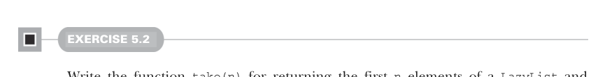

# Page 0130

[<- Page 0129](./page-0129) | [Pages index](./) | [Page 0131 ->](./page-0131)

> Part 1: Introduction to functional programming / Chapter 5: Strictness and laziness / 5.3 Separating program description from evaluation

## 101 5.3 Separating program description from evaluation



#### EXERCISE 5.2

Write the function `take(n)` for returning the first `n` elements of a `LazyList` and `drop(n)` for skipping the first `n` elements of a `LazyList`. Define these functions inside the `LazyList` enum:


```scala
def take(n: Int): LazyList[A]
def drop(n: Int): LazyList[A]
```

#### EXERCISE 5.3

Write the function `takeWhile` for returning all starting elements of a `LazyList` that match the given predicate:

```scala
def takeWhile(p: A => Boolean): LazyList[A]
```

You can use `take` and `toList` together to inspect lazy lists in the REPL. For example, try printing `LazyList(1,2,3).take(2).toList`.

### 5.3 Separating program description from evaluation

A major theme in functional programming is *separation of concerns*. We want to separate the description of computations from actually running them; we’ve already touched on this theme in previous chapters in different ways. For example, first-class functions capture some computation in their bodies but only execute it once they receive their arguments. And we used `Option` to capture the fact that an error occurred, where the decision of what to do about it became a separate concern. With `LazyList`, we’re able to build up a computation that produces a sequence of elements without running the steps of that computation until we need those elements. More generally speaking, laziness lets us separate the description of an expression from the evaluation of that expression. This gives us a powerful ability: we may choose to describe a larger expression than we need and then evaluate only a portion of it. As an example, let’s look at the function `exists` that checks whether an element matching a `Boolean` function exists in this `LazyList`:

```scala
def exists(p: A => Boolean): Boolean = this match
case Cons(h, t) => p(h()) || t().exists(p)
case _ => false
```

Note that `||` is nonstrict in its second argument. If `p(h())` returns `true`, then `exists` terminates the traversal early and returns `true` as well. Remember also that the tail of

[<- Page 0129](./page-0129) | [Pages index](./) | [Page 0131 ->](./page-0131)
