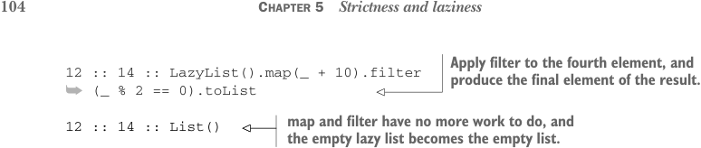
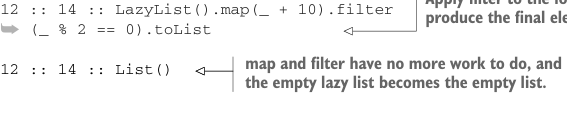

# Page 0133

[<- Page 0132](./page-0132) | [Pages index](./) | [Page 0134 ->](./page-0134)

> Part 1: Introduction to functional programming / Chapter 5: Strictness and laziness / 5.4 Infinite lazy lists and corecursion



> Apply filter to the fourth element, and produce the final element of the result.



```scala
12 :: 14 :: LazyList().map(_ + 10).filter
➥ (_ % 2 == 0).toList
```

> map and filter have no more work to do, and the empty lazy list becomes the empty list.

```scala
12 :: 14 :: List()
```

The thing to notice in this trace is how the `filter` and `map` transformations are interleaved—the computation alternates between generating a single element of the output of `map` and testing with `filter` to see if that element is divisible by `2` (adding it to the output list if it is). Note that we don’t fully instantiate the intermediate lazy list that results from the `map`. It’s exactly as if we had interleaved the logic using a special-purpose loop. For this reason, people sometimes describe lazy lists as *first-class loops* whose logic can be combined using higher-order functions, like `map` and `filter`. Since intermediate lazy lists aren’t instantiated, it’s easy to reuse existing operations in novel ways without having to worry that we’re doing more processing of the lazy list than necessary. For example, we can reuse `filter` to define `find`, a method to return just the first element that matches if it exists. Even though `filter` transforms the whole lazy list, that transformation is done lazily, so `find` terminates as soon as a match is found:

```scala
def find(p: A => Boolean): Option[A] =
filter(p).headOption
```

The incremental nature of lazy list transformations also has important consequences for memory usage. Because intermediate lazy lists aren’t generated, a transformation of the lazy list requires only enough working memory to store and transform the current element. For instance, in the transformation `LazyList(1,2,3,4).map(_` `+` `10)` `.filter(_` `%` `2` `==` `0)`, the garbage collector can reclaim the space allocated for the values `11` and `13` emitted by `map` as soon as `filter` determines they aren’t needed. Of course, this is a simple example; in other situations, we might be dealing with larger numbers of elements, and the lazy list elements themselves could be large objects that retain significant amounts of memory. Being able to reclaim this memory as quickly as possible can cut down on the amount of memory required by your program as a whole. We’ll have a lot more to say about defining memory-efficient streaming calculations, in particular calculations that require I/O, in part 4 of this book.

### 5.4 Infinite lazy lists and corecursion

Because they’re incremental, the functions we’ve written also work for *infinite lazy lists*. Here’s an example of an infinite `LazyList` of `1`s:

```scala
val ones: LazyList[Int] = LazyList.cons(1, ones)
```

Although `ones` is infinite, the functions we’ve written so far only inspect the portion of the lazy list needed to generate the demanded output. For example:

[<- Page 0132](./page-0132) | [Pages index](./) | [Page 0134 ->](./page-0134)
