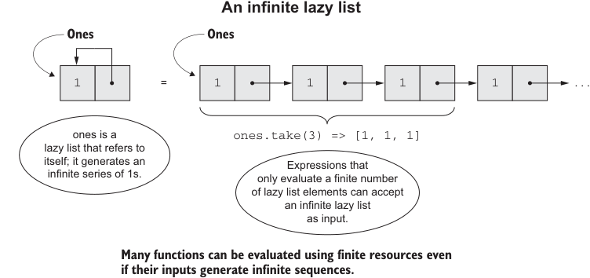

# Page 0134

[<- Page 0133](./page-0133) | [Pages index](./) | [Page 0135 ->](./page-0135)

> Part 1: Introduction to functional programming / Chapter 5: Strictness and laziness / 5.4 Infinite lazy lists and corecursion

## 105 5.4 Infinite lazy lists and corecursion

```scala
scala> ones.take(5).toList
res0: List[Int] = List(1, 1, 1, 1, 1)
scala> ones.exists(_ % 2 != 0)
res1: Boolean = true
```

Try playing with a few other examples:

```scala
ones.map(_ + 1).exists(_ % 2 == 0)
ones.takeWhile(_ == 1)
ones.forAll(_ != 1)
```

In each case, we get back a result immediately. Be careful, though, since it’s easy to write expressions that never terminate or aren’t stack safe. For example, `ones.forAll(_` `==` `1)` will forever need to inspect more of the series since it’ll never encounter an element that allows it to terminate with a definite answer (this will manifest as a stack overflow rather than an infinite loop).7



**An infinite lazy list**

> Ones

> Ones

```scala
1
```

`1` `1` `1` `1`...

=

`ones.take(3) => [1, 1, 1]` ones is a lazy list that refers to itself; it generates an infinite series of 1s. Expressions that only evaluate a finite number of lazy list elements can accept an infinite lazy list as input.

> Many functions can be evaluated using finite resources even if their inputs generate infinite sequences.

Figure 5.1 An infinite lazy list


Let’s see what other functions we can discover for generating lazy lists.

#### EXERCISE 5.8

Generalize `ones` slightly to the function `continually`, which returns an infinite `LazyList` of a given value:

```scala
def continually[A](a: A): LazyList[A]
```

7 It’s possible to define a stack-safe version of `forAll` using an ordinary recursive loop.

[<- Page 0133](./page-0133) | [Pages index](./) | [Page 0135 ->](./page-0135)
