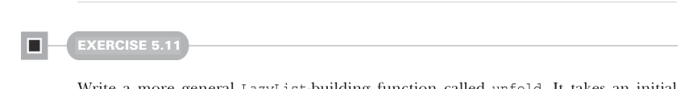

# Page 0135

[<- Page 0134](./page-0134) | [Pages index](./) | [Page 0136 ->](./page-0136)

> Part 1: Introduction to functional programming / Chapter 5: Strictness and laziness / 5.4 Infinite lazy lists and corecursion


#### EXERCISE 5.9

Write a function that generates an infinite lazy list of integers starting from `n`, then `n` `+` `1`, `n` `+` `2`, and so on:8


```scala
def from(n: Int): LazyList[Int]
```

#### EXERCISE 5.10

Write a function `fibs` that generates the infinite lazy list of Fibonacci numbers: 0, 1, 1, 2, 3, 5, 8, and so on.



#### EXERCISE 5.11

Write a more general `LazyList`-building function called `unfold`. It takes an initial state and a function for producing both the next state and the next value in the generated lazy list:

```scala
def unfold[A, S](state: S)(f: S => Option[(A, S)]): LazyList[A]
```

`Option` is used to indicate when the `LazyList` should be terminated, if at all. The function `unfold` is a very general `LazyList`-building function.

The `unfold` function is an example of what’s sometimes called a *corecursive* function. Whereas a recursive function consumes data, a corecursive function produces data. And whereas recursive functions terminate by recursing on smaller inputs, corecursive functions need not terminate so long as they remain *productive*, which just means we can always evaluate more of the result in a finite amount of time. The `unfold` function is productive as long as `f` terminates since we just need to run the function `f` one more time to generate the next element of the `LazyList`. Corecursion is also sometimes called guarded *recursion*, and productivity is also sometimes called *cotermination*. These terms aren’t very important to our discussion, but you’ll hear them used sometimes in the context of functional programming. If you’re curious to learn where they come from and understand some of the deeper connections, follow the references in the chapter notes (https://github.com/fpinscala/fpinscala/wiki).

8 In Scala, the `Int` type is a 32-bit signed integer, so this lazy list will switch from positive to negative values at some point and will repeat itself after about four billion elements.

[<- Page 0134](./page-0134) | [Pages index](./) | [Page 0136 ->](./page-0136)
