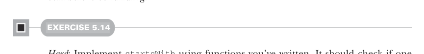

# Page 0136

[<- Page 0135](./page-0135) | [Pages index](./) | [Page 0137 ->](./page-0137)

> Part 1: Introduction to functional programming / Chapter 5: Strictness and laziness / 5.4 Infinite lazy lists and corecursion

## 107 5.4 Infinite lazy lists and corecursion


#### EXERCISE 5.12

Write `fibs`, `from`, `continually`, and `ones` in terms of `unfold`.9

#### EXERCISE 5.13

Use `unfold` to implement `map`, `take`, `takeWhile`, `zipWith` (as in chapter 3), and `zipAll`. The `zipAll` function should continue the traversal as long as either lazy list has more elements; it uses `Option` to indicate whether each lazy list has been exhausted:

```scala
def zipAll[B](that: LazyList[B]): LazyList[(Option[A], Option[B])]
```

Now that we have some practice writing lazy list functions, let’s return to the exercise we covered at the end of chapter 3—a function, `hasSubsequence`—to check whether a list contains a given subsequence. With strict lists and list-processing functions, we were forced to write a rather tricky monolithic loop to implement this function without doing extra work. Using lazy lists, can you see how you could implement `hasSubsequence` by combining some other functions we’ve already written?10 Try to think about it on your own before continuing.



#### EXERCISE 5.14

*Hard*: Implement `startsWith` using functions you’ve written. It should check if one `LazyList` is a prefix of another. For instance, `LazyList(1,2,3).startsWith(LazyList` `(1,2))` would be `true`:

```scala
def startsWith[A](prefix: LazyList[A]): Boolean
```

9 Using `unfold` to define `continually` and `ones` means we don’t get sharing as in the recursive definition `val` `ones:` `LazyList[Int]` `=` `cons(1,` `ones)`. The recursive definition consumes constant memory, even if we keep a reference to it around while traversing it, while the `unfold`-based implementation does not. Preserving sharing isn’t something we usually rely on when programming with lazy lists since it’s extremely delicate and not tracked by the types. For instance, sharing is destroyed when calling even `xs.map(x` `=>` `x)`. 10This small example of assembling `hasSubsequence` from simpler functions using laziness was created by Cale Gibbard. See this post: https://mng.bz/aPP9.

[<- Page 0135](./page-0135) | [Pages index](./) | [Page 0137 ->](./page-0137)
