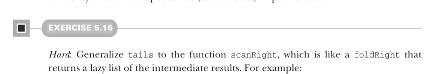
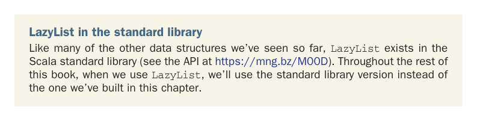

# Page 0137

[<- Page 0136](./page-0136) | [Pages index](./) | [Page 0138 ->](./page-0138)

> Part 1: Introduction to functional programming / Chapter 5: Strictness and laziness / 5.4 Infinite lazy lists and corecursion


#### EXERCISE 5.15

Implement `tails` using `unfold`. For a given `LazyList`, `tails` returns the `LazyList` of suffixes of the input sequence, starting with the original `LazyList`. For example, given `LazyList(1,` `2,` `3)`, it would return `LazyList(LazyList(1,` `2,` `3)`, `LazyList(2,` `3)`, `LazyList(3)`, and `LazyList())`:

```scala
def tails: LazyList[LazyList[A]]
```

We can now implement `hasSubsequence` using functions we’ve written:

```scala
def hasSubsequence[A](l: LazyList[A]): Boolean =
tails.exists(_.startsWith(l))
```

This implementation performs the same number of steps as a more monolithic implementation using nested loops with logic for breaking out of each loop early. By using laziness, we can compose this function from simpler components and still retain the efficiency of the more specialized (and verbose) implementation.



#### EXERCISE 5.16

*Hard*: Generalize `tails` to the function `scanRight`, which is like a `foldRight` that returns a lazy list of the intermediate results. For example:

```scala
scala> LazyList(1, 2, 3).scanRight(0)(_ + _).toList
res0: List[Int] = List(6, 5, 3, 0)
```

This example should be equivalent to the expression `List(1` `+` `2` `+` `3` `+` `0,` `2` `+` `3` `+` `0,` `3` `+` `0,` `0)`. Your function should reuse intermediate results, so traversing a `LazyList` with `n` elements always takes time linear in `n`. Can it be implemented using `unfold`? How, or why not? Could it be implemented using another function we’ve written?



LazyList in the standard library Like many of the other data structures we’ve seen so far, `LazyList` exists in the Scala standard library (see the API at https://mng.bz/M00D). Throughout the rest of this book, when we use `LazyList`, we’ll use the standard library version instead of the one we’ve built in this chapter.

[<- Page 0136](./page-0136) | [Pages index](./) | [Page 0138 ->](./page-0138)
