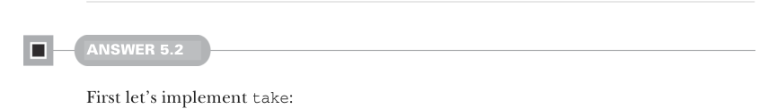

# Page 0139

[<- Page 0138](./page-0138) | [Pages index](./) | [Page 0140 ->](./page-0140)

> Part 1: Introduction to functional programming / Chapter 5: Strictness and laziness / 5.6 Exercise answers

The `unfold` function, which generates a `LazyList` from a seed and a function, is an example of a corecursive function. Corecursive functions produce data and continue to run as long as they are productive.


### 5.6 Exercise answers

#### ANSWER 5.1

The simplest approach is recursing on the structure of the lazy list:

```scala
def toList: List[A] = this match
case Cons(h, t) => h() :: t().toList
case Empty => Nil
```

Like we saw in chapter 3, such recursive definitions are not stack safe since they do additional work with the result of the recursive call. We can write a stack-safe version by using tail recursion:

```scala
def toList: List[A] =
@annotation.tailrec
def go(ll: LazyList[A], acc: List[A]): List[A] =
ll match
case Cons(h, t) => go(t(), h() :: acc)
case Empty => acc.reverse
go(this, Nil)
```



#### ANSWER 5.2

First let’s implement `take`:

```scala
def take(n: Int): LazyList[A] = this match
case Cons(h, t) if n > 1 => cons(h(), t().take(n - 1))
case Cons(h, t) if n == 1 => cons(h(), empty)
case _ => empty
```

If we have a `Cons` and more than 1 element to take, we return a new `Cons` with the head set to the original head and the tail set to recursively calling `take` on the tail `n` decremented. The case where `n` is equal to 1 is more interesting—while we could leave out that case entirely and compute the right answer, doing so unnecessarily forces the computation of the tail due to `t().take(n` `-` `1)`. It’s wasteful to compute that tail just to immediately throw it away, so we define a special case for taking a single element. Similarly, in the case where `n` is 0, we do not force the computation of the head or the tail. We’ll look at this type of lazy evaluation in greater detail in the next section.

[<- Page 0138](./page-0138) | [Pages index](./) | [Page 0140 ->](./page-0140)
