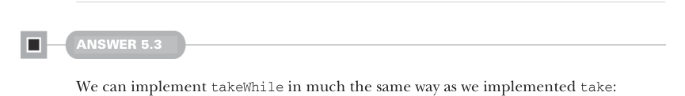
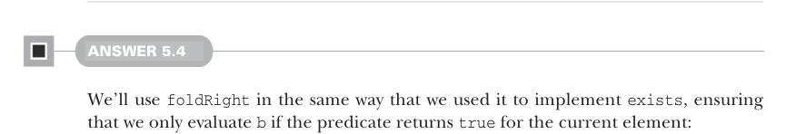
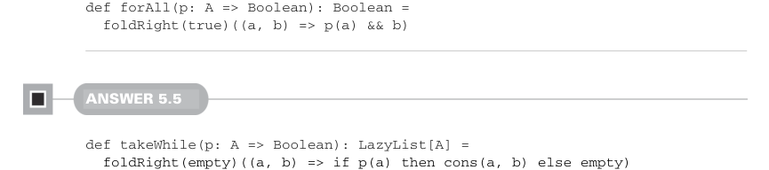

# Page 0140

[<- Page 0139](./page-0139) | [Pages index](./) | [Page 0141 ->](./page-0141)

> Part 1: Introduction to functional programming / Chapter 5: Strictness and laziness / 5.6 Exercise answers

## 111 5.6 Exercise answers

Is this implementation stack safe? At first glance, it appears it isn’t due to the recursive call not being in tail position. However, the recursive call is suspended until the tail of the returned `Cons` is forced, and hence this is stack safe. The `drop` function can be implemented via tail recursion:

```scala
@annotation.tailrec
final def drop(n: Int): LazyList[A] = this match
case Cons(_, t) if n > 0 => t().drop(n - 1)
case _ => this
```

This is very similar to how we would define `drop` on a `List`, but again, note that we do not force the computation of the elements that are dropped.



#### ANSWER 5.3

We can implement `takeWhile` in much the same way as we implemented `take`:

```scala
def takeWhile(p: A => Boolean): LazyList[A] = this match
case Cons(h, t) if p(h()) => cons(h(), t().takeWhile(p))
case _ => empty
```



#### ANSWER 5.4

We’ll use `foldRight` in the same way that we used it to implement `exists`, ensuring that we only evaluate `b` if the predicate returns `true` for the current element:



```scala
def forAll(p: A => Boolean): Boolean =
foldRight(true)((a, b) => p(a) && b)
```

#### ANSWER 5.5

```scala
def takeWhile(p: A => Boolean): LazyList[A] =
foldRight(empty)((a, b) => if p(a) then cons(a, b) else empty)
```

We start the fold with an empty lazy list. For each element, if the predicate evaluates to `true`, then we build a `Cons` using that element and the remainder of the computation, represented by the `b` passed to our folding function.

[<- Page 0139](./page-0139) | [Pages index](./) | [Page 0141 ->](./page-0141)
