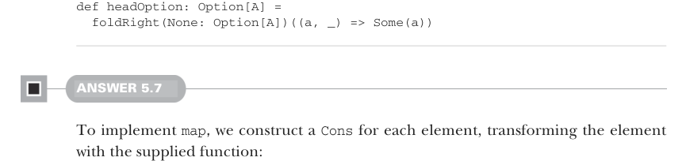

# Page 0141

[<- Page 0140](./page-0140) | [Pages index](./) | [Page 0142 ->](./page-0142)

> Part 1: Introduction to functional programming / Chapter 5: Strictness and laziness / 5.6 Exercise answers


#### ANSWER 5.6

We need to return `None` when the lazy list is empty, so we start our fold with a `None`. Then, when we receive an element and the accumulator (the lazy part of our computation), we simply return the element wrapped in `Some`, ignoring the accumulator. Because the accumulator is discarded, the rest of the lazy list is never evaluated:



```scala
def headOption: Option[A] =
foldRight(None: Option[A])((a, _) => Some(a))
```

#### ANSWER 5.7

To implement `map`, we construct a `Cons` for each element, transforming the element with the supplied function:

```scala
def map[B](f: A => B): LazyList[B] =
foldRight(empty[B])((a, acc) => cons(f(a), acc))
```

Similarly, `filter` tests the element with the supplied predicate and builds a `Cons` if it passes and skips it if it doesn’t:

```scala
def filter(p: A => Boolean): LazyList[A] =
foldRight(empty[A])((a, acc) => if p(a) then cons(a, acc) else acc)
```

The `append` function is a little more interesting:

```scala
def append[A2 >: A](that: => LazyList[A2]): LazyList[A2] =
foldRight(that)((a, acc) => cons(a, acc))
```

We take the argument to append as a by-name parameter, ensuring it is not computed until it is needed. We also need to add a type parameter, `A2`, that’s a supertype of `A`; otherwise, the compiler complains about variance. (Note: if we defined this as a standalone function instead of a method on `LazyList`, we wouldn’t need to worry about variance.) We start the fold with the lazy list we’re appending, and for each element in the original lazy list, we cons it on to the accumulator. Finally, `flatMap` can be implemented using `append`:

```scala
def flatMap[B](f: A => LazyList[B]): LazyList[B] =
foldRight(empty[B])((a, acc) => f(a).append(acc))
```

[<- Page 0140](./page-0140) | [Pages index](./) | [Page 0142 ->](./page-0142)
