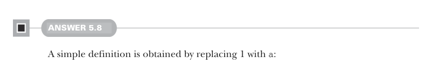
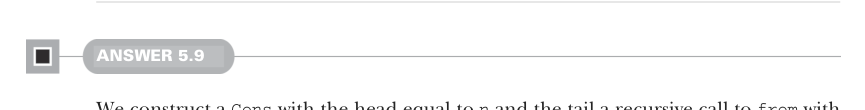

# Page 0142

[<- Page 0141](./page-0141) | [Pages index](./) | [Page 0143 ->](./page-0143)

> Part 1: Introduction to functional programming / Chapter 5: Strictness and laziness / 5.6 Exercise answers

## 113 5.6 Exercise answers



#### ANSWER 5.8

A simple definition is obtained by replacing 1 with `a`:

```scala
def continually[A](a: A): LazyList[A] =
cons(a, continually(a))
```

A more efficient implementation allocates a single `Cons` cell that references itself:

```scala
def continually[A](a: A): LazyList[A] =
lazy val single: LazyList[A] = cons(a, single)
single
```



#### ANSWER 5.9

We construct a `Cons` with the head equal to `n` and the tail a recursive call to `from` with `n` `+` `1`. Like `ones` and `continually`, the infinite recursion is totally safe because the tail is not evaluated until forced:


```scala
def from(n: Int): LazyList[Int] =
cons(n, from(n + 1))
```

#### ANSWER 5.10

We’ll use a recursive auxiliary function that tracks the current and next Fibonacci numbers. When it’s evaluated, it returns a lazy list with the current Fibonacci number as the head and a recursive call as the tail, shifting the next number into the current position and computing a new next by summing `current` and `next`:

```scala
val fibs: LazyList[Int] =
def go(current: Int, next: Int): LazyList[Int] =
cons(current, go(next, current + next))
go(0, 1)
```

Note that we can define this as a `val` instead of a `def`—doing so does not generate the entire infinite sequence.

[<- Page 0141](./page-0141) | [Pages index](./) | [Page 0143 ->](./page-0143)
