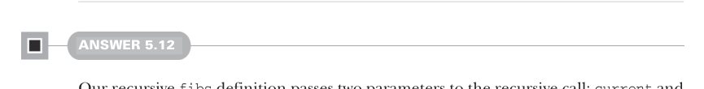
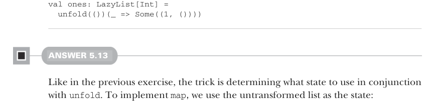

# Page 0143

[<- Page 0142](./page-0142) | [Pages index](./) | [Page 0144 ->](./page-0144)

> Part 1: Introduction to functional programming / Chapter 5: Strictness and laziness / 5.6 Exercise answers


#### ANSWER 5.11

On each invocation of `unfold`, we apply the `state` parameter to the function `f`. If the result is a `None`, then we’re done, so we return the empty lazy list. Otherwise, we return the result of consing the generated value on to the lazy list we get by unfolding with the newly computed state. Once again, the recursion is stack safe because `Cons` lazily evaluates its arguments:

```scala
def unfold[A, S](state: S)(f: S => Option[(A, S)]): LazyList[A] =
f(state) match
case Some((a, s)) => cons(a, unfold(s)(f))
case None => empty
```



#### ANSWER 5.12

Our recursive `fibs` definition passes two parameters to the recursive call: `current` and `next`. We can capture those parameters as the state that’s used in an `unfold` by putting them in a tuple:

```scala
val fibs: LazyList[Int] =
unfold((0, 1)): case (current, next) =>
Some((current, (next, current + next)))
```

Likewise, the state used in `from` is the next integer to emit:

```scala
def from(n: Int): LazyList[Int] =
unfold(n)(n => Some((n, n + 1))
```

The remaining functions need no state, so we can pass any value at all for the unfold state. Normally, we’ll pass a unit value in such circumstances to make it clear we do not use it:

```scala
def continually[A](a: A): LazyList[A] =
unfold(())(_ => Some((a, ())))
```



```scala
val ones: LazyList[Int] =
unfold(())(_ => Some((1, ())))
```

#### ANSWER 5.13

Like in the previous exercise, the trick is determining what state to use in conjunction with `unfold`. To implement `map`, we use the untransformed list as the state:

[<- Page 0142](./page-0142) | [Pages index](./) | [Page 0144 ->](./page-0144)
