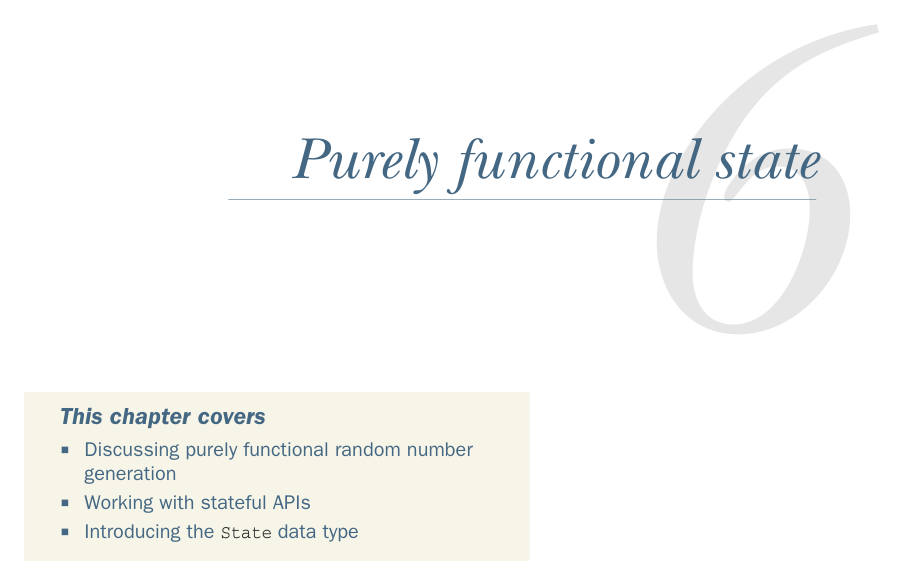

# Page 0147

[<- Page 0146](./page-0146) | [Pages index](./) | [Page 0148 ->](./page-0148)

> Part 1: Introduction to functional programming / Chapter 6: Purely functional state / 6.1 Generating random numbers using side effects

## Purely functional state

### This chapter covers

Discussing purely functional random number generation

Working with stateful APIs

Introducing the `State` data type

In this chapter, we’ll see how to write purely functional programs that manipulate state, using the simple domain of *random number generation* as the example. Although by itself it’s not the most compelling use case for the techniques in this chapter, the simplicity of random number generation makes it a good first example. We’ll see more compelling use cases in parts 3 and 4 of the book, especially part 4, where we’ll discuss dealing with state and effects in much greater detail. The goal here is to provide you with the basic pattern for making any stateful API purely functional. As you start writing your own functional APIs, you’ll likely run into many of the same questions we explore here.

### 6.1 Generating random numbers using side effects If you need to generate random1 numbers in Scala, there’s a class in the standard library, called scala.util.Random (Scala API link: https://mng.bz/7W8g), with a pretty typical imperative API that relies on side effects. The following listing shows an example of its use.

1 Actually, pseudo-random, but we’ll ignore this distinction.

**118**

[<- Page 0146](./page-0146) | [Pages index](./) | [Page 0148 ->](./page-0148)
