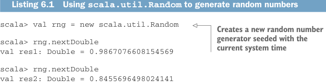

# Page 0148

[<- Page 0147](./page-0147) | [Pages index](./) | [Page 0149 ->](./page-0149)

> Part 1: Introduction to functional programming / Chapter 6: Purely functional state / 6.1 Generating random numbers using side effects

## 119 6.1 Generating random numbers using side effects



Listing 6.1 Using `scala.util.Random` to generate random numbers

```scala
scala> val rng = new scala.util.Random
```

> Creates a new random number generator seeded with the current system time

```scala
scala> rng.nextDouble
val res1: Double = 0.9867076608154569
scala> rng.nextDouble
val res2: Double = 0.8455696498024141
scala> rng.nextInt
val res3: Int = -623297295
```


> Gets a random integer between 0 and 9

```scala
scala> rng.nextInt(10)
val res4: Int = 4
```

Even if we don’t know anything about what happens inside `scala.util.Random`, we can assume the object `rng` has some internal state that gets updated after each invocation, since we’d otherwise get the same value each time we called `nextInt` or `nextDouble`. Because the state updates are performed as a side effect, these methods aren’t referentially transparent. And as we know, this implies that they aren’t as testable, composable, modular, and easily parallelized as they could be. Let’s take testability as an example. If we want to write a method that makes use of randomness, we need tests to be reproducible. Let’s say we had the following sideeffecting method, intended to simulate the rolling of a single six-sided die, which should return a value between 1 and 6, inclusive:


```scala
def rollDie: Int =
val rng = new scala.util.Random
rng.nextInt(6)
```

> Returns a random number from 0 to 5

This method has an off-by-one error. While it’s supposed to return a value between 1 and 6, it actually returns a value from 0 to 5. But even though it doesn’t work properly, a test of this method will meet the specification five out of six times! And if a test did fail, it would be ideal if we could reliably reproduce the failure. Note that what’s important here is not this specific example but the general idea. In this case, the bug is obvious and easy to reproduce. But we can easily imagine a situation where the method is much more complicated and the bug far more subtle. The more complex the program and the subtler the bug, the more important it is to be able to reproduce bugs in a reliable way. One suggestion might be passing in the random number generator. That way, when we want to reproduce a failed test, we can pass the same generator that caused the test to fail:

```scala
def rollDie(rng: scala.util.Random): Int = rng.nextInt(6)
```

But there’s a problem with this solution: the same generator has to be both created with the same seed and be in the same state, which means its methods have been

[<- Page 0147](./page-0147) | [Pages index](./) | [Page 0149 ->](./page-0149)
