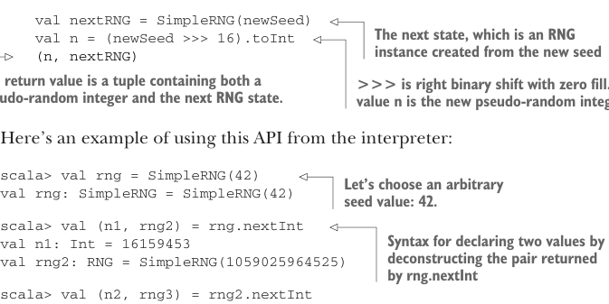
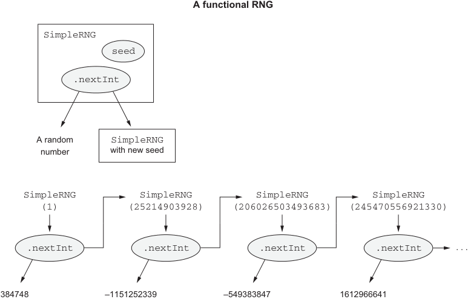

# Page 0150

[<- Page 0149](./page-0149) | [Pages index](./) | [Page 0151 ->](./page-0151)

> Part 1: Introduction to functional programming / Chapter 6: Purely functional state / 6.2 Purely functional random number generation

## 121 6.2 Purely functional random number generation



```scala
val nextRNG = SimpleRNG(newSeed)
val n = (newSeed >>> 16).toInt
(n, nextRNG)
```

> The next state, which is an RNG instance created from the new seed

> >>> is right binary shift with zero fill. The value n is the new pseudo-random integer. The return value is a tuple containing both a pseudo-random integer and the next RNG state.

Here’s an example of using this API from the interpreter:

```scala
scala> val rng = SimpleRNG(42)
val rng: SimpleRNG = SimpleRNG(42)
```

> Let’s choose an arbitrary seed value: 42.

```scala
scala> val (n1, rng2) = rng.nextInt
val n1: Int = 16159453
val rng2: RNG = SimpleRNG(1059025964525)
```

> Syntax for declaring two values by deconstructing the pair returned by rng.nextInt

```scala
scala> val (n2, rng3) = rng2.nextInt
val n2: Int = -1281479697
val rng3: RNG = SimpleRNG(197491923327988)
```

We can run this sequence of statements as many times as we want, and we’ll always get the same values. When we call `rng.nextInt`, it will always return `16159453` and a new `RNG`, whose `nextInt` will always return `-1281479697`. In other words, this `API` is pure. Figure 6.1 summarizes this approach.



**A functional RNG**

```scala
SimpleRNG
seed
.nextInt
```

`SimpleRNG` with new seed A random number

```scala
SimpleRNG
(1)
SimpleRNG
(206026503493683)
SimpleRNG
(245470556921330)
SimpleRNG
(25214903928)
.nextInt
.nextInt
.nextInt
.nextInt
```

...

–1151252339

–549383847

1612966641

384748

> Each call to SimpleRNG.nextInt returns the next random number in the sequence and the SimpleRNG object needed to continue the sequence.

Figure 6.1 A functional RNG

[<- Page 0149](./page-0149) | [Pages index](./) | [Page 0151 ->](./page-0151)
