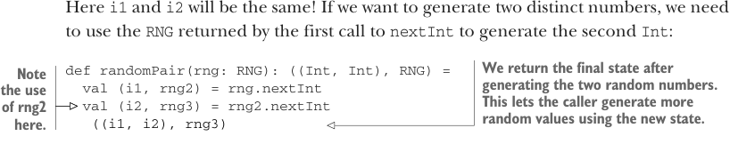

# Page 0151

[<- Page 0150](./page-0150) | [Pages index](./) | [Page 0152 ->](./page-0152)

> Part 1: Introduction to functional programming / Chapter 6: Purely functional state / 6.3 Making stateful APIs pure

### 6.3 Making stateful APIs pure

This problem of making seemingly stateful APIs pure and its solution (having the API compute the next state rather than actually mutate anything) aren’t unique to random number generation. It comes up frequently, and we can always deal with it in this same way.3

For instance, suppose you have a class like this:

```scala
class Foo:
private var s: FooState = ...
def bar: Bar
def baz: Int
```

Suppose `bar` and `baz` each mutate `s` in some way. We can mechanically translate this to the purely functional API by making the transition from one state to the next explicit:

```scala
trait Foo:
def bar: (Bar, Foo)
def baz: (Int, Foo)
```

Whenever we use this pattern, we make the caller responsible for passing the computed next state through the rest of the program. For the pure `RNG` interface just shown, if we reuse a previous `RNG` it will always generate the same value it generated before. For instance:

```scala
def randomPair(rng: RNG): (Int, Int) =
val (i1, _) = rng.nextInt
val (i2, _) = rng.nextInt
(i1, i2)
```



Here `i1` and `i2` will be the same! If we want to generate two distinct numbers, we need to use the `RNG` returned by the first call to `nextInt` to generate the second `Int`:

> We return the final state after generating the two random numbers. This lets the caller generate more random values using the new state.

```scala
def randomPair(rng: RNG): ((Int, Int), RNG) =
val (i1, rng2) = rng.nextInt
val (i2, rng3) = rng2.nextInt
```

> Note the use of rng2 here.

```scala
((i1, i2), rng3)
```

You can see the general pattern, and perhaps you can also see how it might get tedious to use this API directly. Let’s write a few functions to generate random values and see if we notice any repetition we can factor out.

3 An efficiency loss comes with computing next states using pure functions because it means we can’t actually mutate the data in place. (It’s not really a problem here since the state is just a single `Long` that must be copied.) This loss of efficiency can be mitigated by using efficient purely functional data structures. It’s also possible in some cases to mutate the data in place without breaking referential transparency, which we’ll talk about in part 4.

[<- Page 0150](./page-0150) | [Pages index](./) | [Page 0152 ->](./page-0152)
