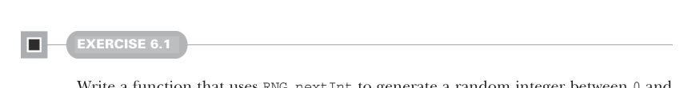
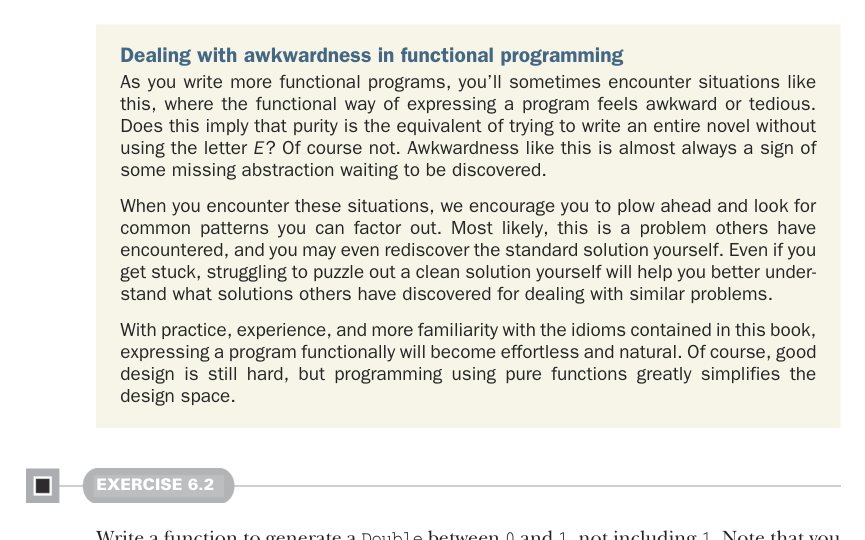
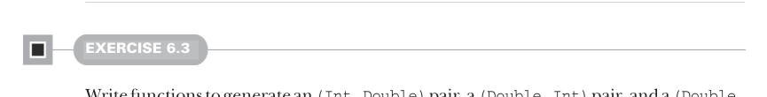

# Page 0152

[<- Page 0151](./page-0151) | [Pages index](./) | [Page 0153 ->](./page-0153)

> Part 1: Introduction to functional programming / Chapter 6: Purely functional state / 6.3 Making stateful APIs pure

## 123 6.3 Making stateful APIs pure



#### EXERCISE 6.1

Write a function that uses `RNG.nextInt` to generate a random integer between `0` and `Int.MaxValue` (inclusive). Make sure to handle the corner case when `nextInt` returns `Int.MinValue`, which doesn’t have a nonnegative counterpart:

```scala
def nonNegativeInt(rng: RNG): (Int, RNG)
```



Dealing with awkwardness in functional programming As you write more functional programs, you’ll sometimes encounter situations like this, where the functional way of expressing a program feels awkward or tedious. Does this imply that purity is the equivalent of trying to write an entire novel without using the letter *E*? Of course not. Awkwardness like this is almost always a sign of some missing abstraction waiting to be discovered.

When you encounter these situations, we encourage you to plow ahead and look for common patterns you can factor out. Most likely, this is a problem others have encountered, and you may even rediscover the standard solution yourself. Even if you get stuck, struggling to puzzle out a clean solution yourself will help you better understand what solutions others have discovered for dealing with similar problems.

With practice, experience, and more familiarity with the idioms contained in this book, expressing a program functionally will become effortless and natural. Of course, good design is still hard, but programming using pure functions greatly simplifies the design space.

#### EXERCISE 6.2

Write a function to generate a `Double` between `0` and `1`, not including `1`. Note that you can use `Int.MaxValue` to obtain the maximum positive integer value, and you can use `x.toDouble` to convert an `x:` `Int` to a `Double`:

```scala
def double(rng: RNG): (Double, RNG)
```



#### EXERCISE 6.3

Write functions to generate an `(Int,` `Double)` pair, a `(Double,` `Int)` pair, and a `(Double,` `Double,` `Double)` 3-tuple. You should be able to reuse the functions you’ve already written:

[<- Page 0151](./page-0151) | [Pages index](./) | [Page 0153 ->](./page-0153)
