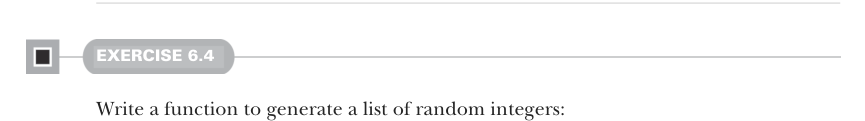

# Page 0153

[<- Page 0152](./page-0152) | [Pages index](./) | [Page 0154 ->](./page-0154)

> Part 1: Introduction to functional programming / Chapter 6: Purely functional state / 6.4 A better API for state actions

```scala
def intDouble(rng: RNG): ((Int, Double), RNG)
def doubleInt(rng: RNG): ((Double, Int), RNG)
def double3(rng: RNG): ((Double, Double, Double), RNG)
```



#### EXERCISE 6.4

Write a function to generate a list of random integers:

```scala
def ints(count: Int)(rng: RNG): (List[Int], RNG)
```

### 6.4 A better API for state actions

Looking back at our implementations, we’ll notice a common pattern: each of our functions has a type of the form `RNG` `=>` `(A,` `RNG)` for some type `A`. Functions of this type are called *state actions* or *state transitions* because they transform `RNG` states from one to the next. These state actions can be combined in various ways to generate new state actions. We’ll define a number of such combining functions in this section. Since it’s pretty tedious and repetitive to pass the state along ourselves, we want our functions to pass the state from one action to the next automatically. To make the type of actions convenient to talk about and to simplify our thinking about them, let’s make a type alias for the `RNG` state action data type:

```scala
type Rand[+A] = RNG => (A, RNG)
```

We can think of a value of type `Rand[A]` as a *randomly generated *`A`, although that’s not really precise. It’s really a state action—a program that depends on some `RNG`, uses it to generate an `A`, and transitions the `RNG` to a new state that can be used by another action later. We can now turn methods such as `RNG`’s `nextInt` into values of this new type:

> We could even use the shortand _.nextInt.

```scala
val int: Rand[Int] = rng => rng.nextInt
```

We want to write functions that let us combine `Rand` actions, while avoiding explicitly passing along the `RNG` state. We’ll end up with a kind of domain-specific language that does all the passing for us. For example, a simple `RNG` state transition is the `unit` action, which passes the `RNG` state through without using it, always returning a constant value rather than a random value:

```scala
def unit[A](a: A): Rand[A] =
rng => (a, rng)
```

There’s also `map` for transforming the output of a state action without further modifying the resultant state. Remember that `Rand[A]` is just a type alias for a function type `RNG` `=>` `(A,` `RNG)`, so this is just a kind of function composition:

[<- Page 0152](./page-0152) | [Pages index](./) | [Page 0154 ->](./page-0154)
