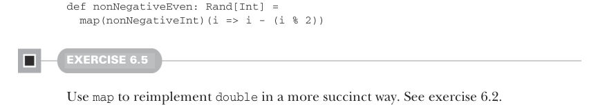
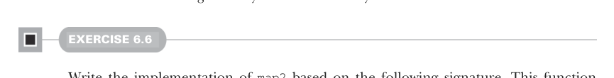

# Page 0154

[<- Page 0153](./page-0153) | [Pages index](./) | [Page 0155 ->](./page-0155)

> Part 1: Introduction to functional programming / Chapter 6: Purely functional state / 6.4 A better API for state actions / 6.4.1 Combining state actions

## 125 6.4 A better API for state actions

```scala
def map[A, B](s: Rand[A])(f: A => B): Rand[B] =
rng =>
val (a, rng2) = s(rng)
(f(a), rng2)
```

As an example of how `map` is used, here’s `nonNegativeEven`, which reuses `nonNegative-` `Int` to generate an `Int` that’s greater than or equal to zero and divisible by two:



```scala
def nonNegativeEven: Rand[Int] =
map(nonNegativeInt)(i => i - (i % 2))
```

#### EXERCISE 6.5

Use `map` to reimplement `double` in a more succinct way. See exercise 6.2.

### 6.4.1 Combining state actions

Unfortunately, `map` isn’t powerful enough to implement `intDouble` and `doubleInt` from exercise 6.3. Instead, we need a new function, `map2`, that can combine two `RNG` actions into one using a binary rather than unary function.



#### EXERCISE 6.6

Write the implementation of `map2` based on the following signature. This function takes two actions, `ra` and `rb`, and a function, `f`, for combining their results and returns a new action that combines them:

```scala
def map2[A, B, C](ra: Rand[A], rb: Rand[B])(f: (A, B) => C): Rand[C]
```

We only have to write the `map2` function once, and then we can use it to combine arbitrary `RNG` state actions. For example, if we have an action that generates values of type `A` and another to generate values of type `B`, then we can combine them into one action that generates pairs of both `A` and `B`:

```scala
def both[A, B](ra: Rand[A], rb: Rand[B]): Rand[(A, B)] =
map2(ra, rb)((_, _))
```

We can use this to reimplement `intDouble` and `doubleInt` from exercise 6.3 more succinctly:

```scala
val randIntDouble: Rand[(Int, Double)] =
both(int, double)
val randDoubleInt: Rand[(Double, Int)] =
both(double, int)
```

[<- Page 0153](./page-0153) | [Pages index](./) | [Page 0155 ->](./page-0155)
