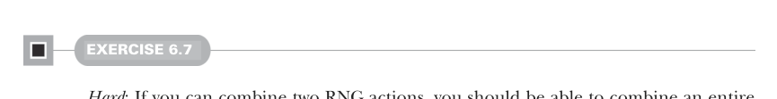

# Page 0155

[<- Page 0154](./page-0154) | [Pages index](./) | [Page 0156 ->](./page-0156)

> Part 1: Introduction to functional programming / Chapter 6: Purely functional state / 6.4 A better API for state actions / 6.4.2 Nesting state actions



#### EXERCISE 6.7

*Hard*: If you can combine two RNG actions, you should be able to combine an entire list of them. Implement `sequence` for combining a `List` of actions into a single action. Use it to reimplement the `ints` function you wrote before. For the latter, you can use the standard library function `List.fill(n)(x)` to make a list with `x` repeated `n` times:

```scala
def sequence[A](rs: List[Rand[A]]): Rand[List[A]]
```

### 6.4.2 Nesting state actions

A pattern is beginning to emerge: we’re progressing toward implementations that don’t explicitly mention or pass along the `RNG` value. The `map` and `map2` functions allowed us to implement, in a rather succinct and elegant way, functions that were otherwise tedious and error-prone to write. But there are some functions we can’t write in terms of `map` and `map2`. One such function is `nonNegativeLessThan`, which generates an integer between 0 (inclusive) and `n` (exclusive):

```scala
def nonNegativeLessThan(n: Int): Rand[Int]
```

A first stab at an implementation might be to generate a non-negative integer modulo `n`:

```scala
def nonNegativeLessThan(n: Int): Rand[Int] =
map(nonNegativeInt)(_ % n)
```

This will certainly generate a number in the range, but it’ll be skewed because `Int.MaxValue` may not be exactly divisible by `n`. So numbers less than the remainder of that division will come up more frequently. When `nonNegativeInt` generates numbers higher than the largest multiple of `n` that fits in a 32-bit integer, we should retry the generator and hope to get a smaller number. We might attempt this:

> Retry recursively if the Int we got is higher than the largest multiple of n that fits in a 32-bit Int.

```scala
def nonNegativeLessThan(n: Int): Rand[Int] =
map(nonNegativeInt): i =>
val mod = i % n
if i + (n-1) - mod >= 0 then mod else nonNegativeLessThan(n)(???)
```

This is moving in the right direction, but `nonNegativeLessThan(n)` has the wrong type. Remember that it should return a `Rand[Int]`, which is a function that expects an `RNG`. But we don’t have a `RNG` value to pass to the result of `nonNegativeLessThan(n)` there. What we would like is to chain things together so the `RNG` that’s returned by `nonNegativeInt` is passed along to the recursive call to `nonNegativeLessThan`. We could pass it along explicitly instead of using `map`, like this:

[<- Page 0154](./page-0154) | [Pages index](./) | [Page 0156 ->](./page-0156)
