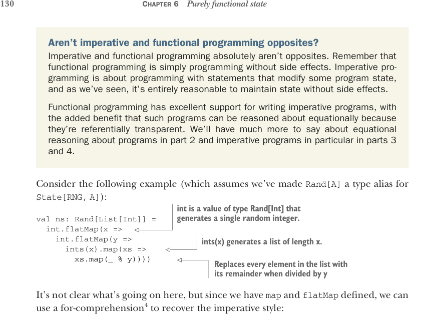

# Page 0159

[<- Page 0158](./page-0158) | [Pages index](./) | [Page 0160 ->](./page-0160)

> Part 1: Introduction to functional programming / Chapter 6: Purely functional state / 6.6 Purely functional imperative programming



Aren’t imperative and functional programming opposites? Imperative and functional programming absolutely aren’t opposites. Remember that functional programming is simply programming without side effects. Imperative programming is about programming with statements that modify some program state, and as we’ve seen, it’s entirely reasonable to maintain state without side effects.

Functional programming has excellent support for writing imperative programs, with the added benefit that such programs can be reasoned about equationally because they’re referentially transparent. We’ll have much more to say about equational reasoning about programs in part 2 and imperative programs in particular in parts 3 and 4.

Consider the following example (which assumes we’ve made `Rand[A]` a type alias for `State[RNG,` `A]`):

> int is a value of type Rand[Int] that generates a single random integer.

```scala
val ns: Rand[List[Int]] =
int.flatMap(x =>
int.flatMap(y =>
ints(x).map(xs =>
```

> ints(x) generates a list of length x.

```scala
xs.map(_ % y))))
```

> Replaces every element in the list with its remainder when divided by y

It’s not clear what’s going on here, but since we have `map` and `flatMap` defined, we can use a for-comprehension4 to recover the imperative style:


> Generates an integer x

```scala
val ns: Rand[List[Int]] =
for
x <- int
y <- int
xs <- ints(x)
yield xs.map(_ % y)
```

> Generates another integer y

> Generates a list xs of length x

> Returns the list xs with each element replaced with its remainder when divided by y

This code is much easier to read (and write), and it looks like what it is: an imperative program that maintains some state. But it’s the same code. We get the next `Int` and assign it to `x`, get the next `Int` after that and assign it to `y`, generate a list of length `x`, and, finally, return the list with all of its elements modulo `y`. To facilitate this kind of imperative programming with for-comprehensions (or `flatMaps`), we really only need two primitive `State` constructors: one for reading the state and one for writing the state. If we imagine that we have a constructor `get` for getting the current state and a constructor `set` for setting a new state, then we could implement a constructor that could modify the state in arbitrary ways:

4 Remember that for-comprehensions are just syntax sugar for a sequence of calls to `flatMap` followed by a final `map`. See the for-comprehensions section in chapter 4 for details.

[<- Page 0158](./page-0158) | [Pages index](./) | [Page 0160 ->](./page-0160)
