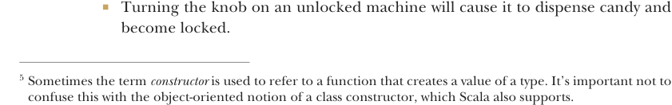

# Page 0160

[<- Page 0159](./page-0159) | [Pages index](./) | [Page 0161 ->](./page-0161)

> Part 1: Introduction to functional programming / Chapter 6: Purely functional state / 6.6 Purely functional imperative programming


## 131 6.6 Purely functional imperative programming

```scala
def modify[S](f: S => S): State[S, Unit] =
for
s <- get
_ <- set(f(s))
yield ()
```

> Gets the current state and assigns it to s

> Sets the new state to f applied to s

This constructor5 returns a `State` action that modifies the incoming state by the function `f`. It yields `Unit` to indicate that it doesn’t have a return value other than the state. What would the `get` and `set` actions look like? They’re exceedingly simple. The `get` action simply passes the incoming state along and returns it as the value:

```scala
def get[S]: State[S, S] = s => (s, s)
```

The `set` action is constructed with a new state `s`. The resulting action ignores the incoming state, replaces it with the new state, and returns `()` instead of a meaningful value:

```scala
def set[S](s: S): State[S, Unit] = _ => ((), s)
```

These two simple actions along with the `State` functions we wrote—`unit`, `map`, `map2`, and `flatMap`—are all the tools we need to implement any kind of state machine or stateful program in a purely functional way. Instead of mutable data structures and side effects, we use immutable data structures and functions that compute the next state from the previous, and we use `State` to remove the boilerplate.


#### EXERCISE 6.11

*Hard*: To get some experience using `State`, implement a finite state automaton that models a simple candy dispenser. The machine has two types of input: you can insert a coin, or you can turn the knob to dispense candy. It can be in one of two states: locked or unlocked. It also tracks how many candies are left and how many coins it contains:

```scala
enum Input:
case Coin, Turn
case class Machine(locked: Boolean, candies: Int, coins: Int)
```

The rules of the machine are as follows:

Inserting a coin into a locked machine will cause it to unlock if there’s any candy left.



Turning the knob on an unlocked machine will cause it to dispense candy and become locked.

5 Sometimes the term *constructor* is used to refer to a function that creates a value of a type. It’s important not to confuse this with the object-oriented notion of a class constructor, which Scala also supports.

[<- Page 0159](./page-0159) | [Pages index](./) | [Page 0161 ->](./page-0161)
