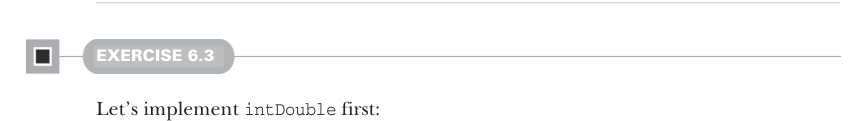

# Page 0162

[<- Page 0161](./page-0161) | [Pages index](./) | [Page 0163 ->](./page-0163)

> Part 1: Introduction to functional programming / Chapter 6: Purely functional state / 6.8 Exercise Answers

## 133 6.8 Exercise Answers

 `State` supports the same operations as `Rand`—`unit`, `map`, `map2`, `flatMap`, and `sequence`—since none of these operations had any dependency on `Rng` being the state type.

The `State` data type simplifies working with stateful APIs by removing the need to manually thread input and output states throughout computations.

State computations can be built with for-comprehensions, which result in imperative-looking code.


### 6.8 Exercise Answers

#### EXERCISE 6.1

```scala
def nonNegativeInt(rng: RNG): (Int, RNG) =
val (i, r) = rng.nextInt
(if i < 0 then -(i + 1) else i, r)
```

We first call `rng.nextInt` to generate an integer from `Int.MinValue` to `Int.MaxValue`. We unpack the resulting tuple into two values: `i` for the generated random value and `r` for the next `RNG`. If `i` is nonnegative, then we can safely return it. Otherwise, we increment the result by one and flip its sign. Note that this solution doesn’t skew random number generation because there are exactly the same number of values in the range `[Int.MinValue,` `-1]` as in the range `[0,` `Int.MaxValue]`. In both cases, we pair the result with the next `RNGr`.


#### EXERCISE 6.2

We use the `nonNegativeInt` function we wrote in the previous exercise to generate an integer in the range `[0,` `Int.MaxValue]`. We then divide that value by `Int.MaxValue` `+` `1` to adjust the result to the desired range. Again, we have to pair the result with the next `RNG` value:

```scala
def double(rng: RNG): (Double, RNG) =
val (i, r) = nonNegativeInt(rng)
(i / (Int.MaxValue.toDouble + 1), r)
```



#### EXERCISE 6.3

Let’s implement `intDouble` first:

```scala
def intDouble(rng: RNG): ((Int, Double), RNG) =
val (i, r1) = rng.nextInt
val (d, r2) = double(r1)
((i, d), r2)
```

[<- Page 0161](./page-0161) | [Pages index](./) | [Page 0163 ->](./page-0163)
