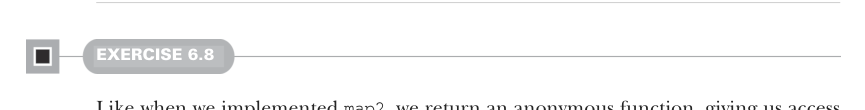

# Page 0165

[<- Page 0164](./page-0164) | [Pages index](./) | [Page 0166 ->](./page-0166)

> Part 1: Introduction to functional programming / Chapter 6: Purely functional state / 6.8 Exercise Answers


#### EXERCISE 6.7

We use a `foldRight` over the supplied list of `RNG` actions, starting with a `unit(Nil:` `List[A])`—an `RNG` action that passes through the `RNG` parameter without using it, returning an empty list. For each action in the original list, we compute an output of type `Rand[List[A]]`, using an input element of type `Rand[A]` and an accumulated `Rand[List[A]]`. We use `map2` to combine those actions into a new action, consing the output value of the first action onto the output list of the accumulated action:

```scala
def sequence[A](rs: List[Rand[A]]): Rand[List[A]] =
rs.foldRight(unit(Nil: List[A]))((r, acc) => map2(r, acc)(_ :: _))
```

This is eerily similar to the definition of `sequence` for `Option` from exercise 4.4:

```scala
def sequence[A](as: List[Option[A]]): Option[List[A]] =
as.foldRight(Some(Nil): Option[List[A]])((a, acc) => map2(a, acc)(_ :: _))
```

This similarity hints at an undiscovered abstraction—something that lets us write `sequence` once for a variety of data types. We’ll return to this idea in chapter 12. Finally, we can define `ints` in terms of `sequence` by creating a list of the requested size and setting each element to the `int` value we defined earlier:

```scala
def ints(count: Int): Rand[List[Int]] =
sequence(List.fill(count)(int))
```



#### EXERCISE 6.8

Like when we implemented `map2`, we return an anonymous function, giving us access to the starting `RNG`. We apply this initial `RNG` to the supplied action, resulting in a value of type `A` and a new `RNG`. We then apply that `A` value to the supplied function `f`, giving us a `Rand[B]`. Finally, we apply our earlier output `RNG` to that `Rand[B]`, yielding a `(B,` `RNG)`. If we hadn’t invoked the function returned from `f(a)`, which is a value of type `Rand[B]`, then we’d have gotten a compilation error:

```scala
def flatMap[A, B](r: Rand[A])(f: A => Rand[B]): Rand[B] =
rng0 =>
val (a, rng1) = r(rng0)
f(a)(rng1)
```

`nonNegativeLessThan` can be implemented by calling `flatMap` on `nonNegativeInt` and passing an anonymous function that returns a `Rand[Int]`. If we find a value that meets our criteria, we return it, but we must convert it from an `Int` to a `Rand[Int]` first. We do so via `unit`; otherwise, if our output value doesn’t meet our criteria, then we recursively call `nonNegativeLessThan(n)` to generate a new output value:

[<- Page 0164](./page-0164) | [Pages index](./) | [Page 0166 ->](./page-0166)
