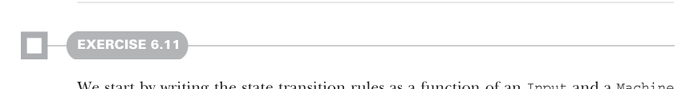

# Page 0167

[<- Page 0166](./page-0166) | [Pages index](./) | [Page 0168 ->](./page-0168)

> Part 1: Introduction to functional programming / Chapter 6: Purely functional state / 6.8 Exercise Answers

This is almost identical to the earlier definition of `unit` defined specifically for `Rand`. The only significant difference is in the type signature, where we added a type parameter `S` instead of hardcoding `Rand`.6

In exercise 6.9, we saw that `map` and `map2` can be implemented in terms of `flatMap`, so we can directly port their implementations to extension methods. Similarly, we can directly port `flatMap`, adjusting only type parameters and names. And now that we have methods for `map` and `flatMap`, in lieu of standalone functions, we can use a forcomprehension to define `map2`:

```scala
extension [S, A](underlying: State[S, A])
def run(s: S): (A, S) = underlying(s)
def map[B](f: A => B): State[S, B] =
flatMap(a => unit(f(a)))
def map2[B, C](sb: State[S, B])(f: (A, B) => C): State[S, C] =
for
a <- underlying
b <- sb
yield f(a, b)
def flatMap[B](f: A => State[S, B]): State[S, B] =
s =>
val (a, s1) = underlying(s)
f(a)(s1)
```

Lastly, we can define `sequence` on the companion object of `State`, making only minimal changes to pass the `S` type parameter throughout:

```scala
def sequence[S, A](states: List[State[S, A]]): State[S, List[A]] =
states.foldRight(unit[S, List[A]](Nil))((s, acc) => s.map2(acc)(_ :: _))
```



#### EXERCISE 6.11

We start by writing the state transition rules as a function of an `Input` and a `Machine` that returns a new `Machine`. Each rule is implemented via a pattern match on the input and current machine state:

```scala
def update(i: Input, s: Machine): Machine =
(i, s) match
case (_, Machine(_, 0, _)) => s
case (Input.Coin, Machine(false, _, _)) => s
case (Input.Turn, Machine(true, _, _)) => s
case (Input.Coin, Machine(true, candy, coin)) =>
Machine(false, candy, coin + 1)
case (Input.Turn, Machine(false, candy, coin)) =>
Machine(true, candy - 1, coin)
```

6 If using the case class encoding, we need to wrap the anonymous function like so: `State(s => (a, s))`.

[<- Page 0166](./page-0166) | [Pages index](./) | [Page 0168 ->](./page-0168)
