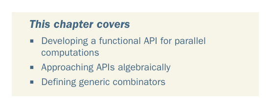

# Page 0172

[<- Page 0171](./page-0171) | [Pages index](./) | [Page 0173 ->](./page-0173)

> Part 2: Functional design and combinator libraries / Chapter 7: Purely functional parallelism

## Purely functional parallelism

### This chapter covers

Developing a functional API for parallel computations

Approaching APIs algebraically

Defining generic combinators

Because modern computers have multiple cores per CPU, and often multiple CPUs, it’s more important than ever to design programs in such a way that they can take advantage of this parallel processing power. But the interaction of programs that run with parallelism is complex, and the traditional mechanism for communication among execution threads—shared mutable memory—is notoriously difficult to reason about. This can all too easily result in programs that have race conditions and deadlocks, aren’t readily testable, and don’t scale well. In this chapter, we’ll build a purely functional library for creating parallel and asynchronous computations. We’ll rein in the complexity inherent in parallel programs by describing them using only pure functions. This will let us use the substitution

**143**

[<- Page 0171](./page-0171) | [Pages index](./) | [Page 0173 ->](./page-0173)
