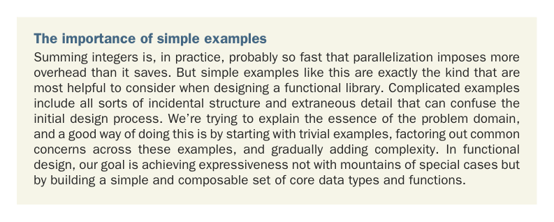

# Page 0174

[<- Page 0173](./page-0173) | [Pages index](./) | [Page 0175 ->](./page-0175)

> Part 2: Functional design and combinator libraries / Chapter 7: Purely functional parallelism / 7.1 Choosing data types and functions

## 145 7.1 Choosing data types and functions

exactly? Let’s try to refine this into something we can implement by examining a simple, parallelizable computation: summing a list of integers. The usual left fold for this would be as follows:

```scala
def sum(ints: Seq[Int]): Int =
ints.foldLeft(0)((a, b) => a + b)
```

Here `Seq` is a superclass of lists and other sequences in the standard library. Importantly, it has a `foldLeft` method. Instead of folding sequentially, we could use a divideand-conquer algorithm (see the following listing).

Listing 7.1 Summing a list using a divide-and-conquer algorithm


> IndexedSeq is a superclass of random-access sequences, like Vector, in the standard library. Unlike lists, these sequences provide an efficient splitAt method for dividing them into two parts at a particular index.

```scala
def sum(ints: IndexedSeq[Int]): Int =
if ints.size <= 1 then
ints.headOption.getOrElse(0)
else
val (l, r) = ints.splitAt(ints.size / 2)
sum(l) + sum(r)
```

> headOption is a method defined on all collections in Scala. We saw this function in chapter 4.

> Divides the sequence in half using the splitAt function Recursively sums both halves and adds the results together

We divide the sequence in half using the `splitAt` function, recursively sum both halves, and then combine their results. And unlike the `foldLeft`-based implementation, this implementation can be parallelized; the two halves can be summed in parallel.



The importance of simple examples Summing integers is, in practice, probably so fast that parallelization imposes more overhead than it saves. But simple examples like this are exactly the kind that are most helpful to consider when designing a functional library. Complicated examples include all sorts of incidental structure and extraneous detail that can confuse the initial design process. We’re trying to explain the essence of the problem domain, and a good way of doing this is by starting with trivial examples, factoring out common concerns across these examples, and gradually adding complexity. In functional design, our goal is achieving expressiveness not with mountains of special cases but by building a simple and composable set of core data types and functions.

As we think about what sort of data types and functions could enable parallelizing this computation, we can shift our perspective. Rather than focusing on how this parallelism will ultimately be implemented and forcing ourselves to work with the implementation APIs directly (likely related to `java.lang.Thread` and the `java.util.concurrent` library), we’ll instead design our own ideal API, as illuminated by our examples, and work backward from there to an implementation.

[<- Page 0173](./page-0173) | [Pages index](./) | [Page 0175 ->](./page-0175)
