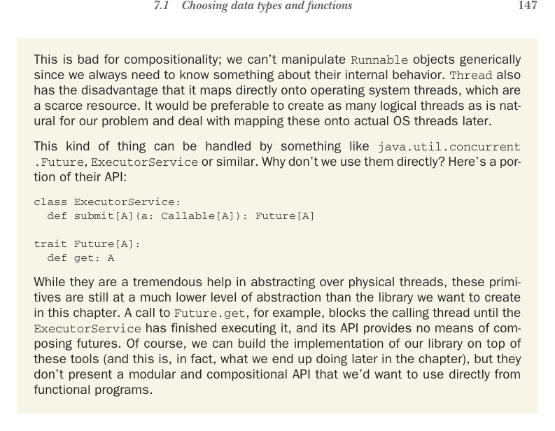

# Page 0176

[<- Page 0175](./page-0175) | [Pages index](./) | [Page 0177 ->](./page-0177)

> Part 2: Functional design and combinator libraries / Chapter 7: Purely functional parallelism / 7.1 Choosing data types and functions / 7.1.1 A data type for parallel computations



## 147 7.1 Choosing data types and functions

This is bad for compositionality; we can’t manipulate `Runnable` objects generically since we always need to know something about their internal behavior. `Thread` also has the disadvantage that it maps directly onto operating system threads, which are a scarce resource. It would be preferable to create as many logical threads as is natural for our problem and deal with mapping these onto actual OS threads later.

This kind of thing can be handled by something like `java.util.concurrent` `.Future`, `ExecutorService` or similar. Why don’t we use them directly? Here’s a portion of their API:

```scala
class ExecutorService:
def submit[A](a: Callable[A]): Future[A]
trait Future[A]:
def get: A
```

While they are a tremendous help in abstracting over physical threads, these primitives are still at a much lower level of abstraction than the library we want to create in this chapter. A call to `Future.get`, for example, blocks the calling thread until the `ExecutorService` has finished executing it, and its API provides no means of composing futures. Of course, we can build the implementation of our library on top of these tools (and this is, in fact, what we end up doing later in the chapter), but they don’t present a modular and compositional API that we’d want to use directly from functional programs.

We now have a choice about the meaning of `unit` and `get`; `unit` could begin evaluating its argument immediately in a separate (logical) thread,1 or it could simply hold onto its argument until `get` is called and begin evaluation then. But note that in this example, if we want to obtain any degree of parallelism, we require `unit` to begin evaluating its argument concurrently and return immediately. Can you see why?2

But if `unit` begins evaluating its argument concurrently, then calling `get` arguably breaks referential transparency. We can see this by replacing `sumL` and `sumR` with their definitions; if we do so, we still get the same result, but our program is no longer parallel:

```scala
Par.get(Par.unit(sum(l))) + Par.get(Par.unit(sum(r)))
```

If `unit` starts evaluating its argument right away, `get` will wait for that evaluation to complete. This means the two sides of the `+` sign won’t run in parallel if we simply inline the `sumL` and `sumR` variables. We can see that `unit` has a definite side effect but only with regard to `get`. That is, `unit` simply returns a `Par[Int]` in this case, representing an

1 We’ll use the term *logical thread* somewhat informally throughout this chapter to mean a computation that runs concurrently with the main execution thread of our program. There need not be a one-to-one correspondence between logical threads and OS threads; we may have a large number of logical threads mapped onto a smaller number of OS threads via thread pooling, for instance. 2 Function arguments in Scala are strictly evaluated from left to right, so if `unit` delays execution until `get` is called, then we will both spawn the parallel computation and wait for it to finish before spawning the second parallel computation. This means the computation is effectively sequential!

[<- Page 0175](./page-0175) | [Pages index](./) | [Page 0177 ->](./page-0177)
