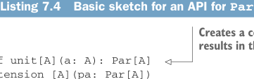

# Page 0181

[<- Page 0180](./page-0180) | [Pages index](./) | [Page 0182 ->](./page-0182)

> Part 2: Functional design and combinator libraries / Chapter 7: Purely functional parallelism / 7.2 Picking a representation

reasoned informally about the sort of information required to actually spawn a parallel task and examined the consequences of having `Par` values know this information. In contrast, if `fork` simply holds onto its unevaluated argument until later, it requires no access to the mechanism for implementing parallelism; it just takes an unevaluated `Par` and marks it for concurrent evaluation. Let’s now assume this meaning for `fork`. With this model, `Par` itself doesn’t need to know how to actually implement the parallelism. It’s more a description of a parallel computation that gets interpreted at a later time by something like the `get` function. This is a shift from before, where we were considering `Par` to be a container of a value that we could simply get when it becomes available. Now it’s more of a first-class program we can run. So let’s rename our `get` function to `run` and dictate that this is where the parallelism actually gets implemented:

```scala
extension [A](pa: Par[A]) def run: A
```

Because `Par` is now just a pure data structure, `run` needs to have some means of implementing the parallelism, whether it spawns new threads, delegates tasks to a thread pool, or uses some other mechanism.

### 7.2 Picking a representation

Just by exploring this simple example and thinking through the consequences of different choices, we’ve sketched out the following API.

Listing 7.4 Basic sketch for an API for `Par`



> Creates a computation that immediately results in the value a Combines the results of two parallel computations with a binary function


```scala
def unit[A](a: A): Par[A]
extension [A](pa: Par[A])
def map2[B, C](pb: Par[B])(f: (A, B) => C): Par[C]
def fork[A](a: => Par[A]): Par[A]
def lazyUnit[A](a: => A): Par[A] = fork(unit(a))
extension [A](pa: Par[A]) def run: A
```

> Marks a computation for concurrent evaluation by run

> Wraps the expression a for concurrent evaluation by run Fully evaluates a given Par, spawning parallel computations as requested by fork and extracting the resulting value

We’ve also loosely assigned meaning to these various functions:

 `unit`—Promotes a constant value to a parallel computation

 `map2`—Combines the results of two parallel computations with a binary function

 `fork`—Marks a computation for concurrent evaluation—the evaluation won’t occur until forced by `run`

 `lazyUnit`—Wraps its unevaluated argument in a `Par` and marks it for concurrent evaluation

 `run`—Extracts a value from a `Par` by performing the computation

At any point while sketching out an API, you can start thinking about possible representations for the abstract types that appear.

[<- Page 0180](./page-0180) | [Pages index](./) | [Page 0182 ->](./page-0182)
