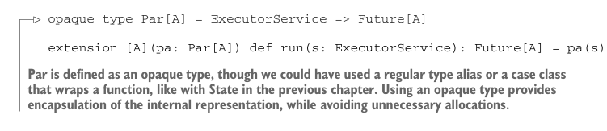

# Page 0182

[<- Page 0181](./page-0181) | [Pages index](./) | [Page 0183 ->](./page-0183)

> Part 2: Functional design and combinator libraries / Chapter 7: Purely functional parallelism / 7.2 Picking a representation

## 153 7.2 Picking a representation


#### EXERCISE 7.2

Before continuing, try to come up with representations for `Par` that make it possible to implement the functions of our API.

Let’s see if we can come up with a representation. We know `run` needs to execute asynchronous tasks somehow. We could write our own low-level API, but there’s already a class we can use in the Java Standard Library: `java.util.concurrent.ExecutorService`. Here is its API, excerpted and transcribed to Scala:

```scala
class ExecutorService:
def submit[A](a: Callable[A]): Future[A]
trait Callable[A]:
def call: A
```

> Essentially just a lazy A

```scala
trait Future[A]:
def get: A
def get(timeout: Long, unit: TimeUnit): A
def cancel(evenIfRunning: Boolean): Boolean
def isDone: Boolean
def isCancelled: Boolean
```

So `ExecutorService` lets us submit a `Callable` value (in Scala we’d probably just use a lazy argument to `submit`) and get back a corresponding `Future` that’s a handle to a computation that’s potentially running in a separate thread. We can obtain a value from a `Future` with its `get` method (which blocks the current thread until the value is available), and it has some extra features for cancellation (throwing an exception after blocking for a certain amount of time and so on). Let’s try assuming our `run` function has access to an `ExecutorService` and see if that suggests anything about the representation for `Par`:

```scala
extension [A](pa: Par[A]) def run(s: ExecutorService): A
```

The simplest possible model for `Par[A]` might be `ExecutorService` `=>` `A`. This would make `run` trivial to implement. But it might be nice to defer the decision of how long to wait for a computation, or whether to cancel it, to the caller of `run`. So `Par[A]` becomes `ExecutorService` `=>` `Future[A]`, and `run` simply returns the `Future`:



```scala
opaque type Par[A] = ExecutorService => Future[A]
extension [A](pa: Par[A]) def run(s: ExecutorService): Future[A] = pa(s)
```

> Par is defined as an opaque type, though we could have used a regular type alias or a case class that wraps a function, like with State in the previous chapter. Using an opaque type provides encapsulation of the internal representation, while avoiding unnecessary allocations.

[<- Page 0181](./page-0181) | [Pages index](./) | [Page 0183 ->](./page-0183)
