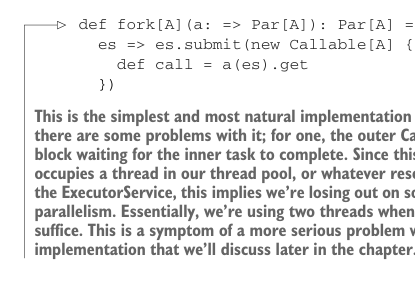
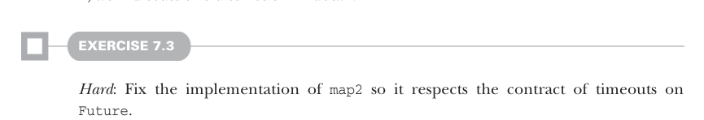

# Page 0184

[<- Page 0183](./page-0183) | [Pages index](./) | [Page 0185 ->](./page-0185)

> Part 2: Functional design and combinator libraries / Chapter 7: Purely functional parallelism / 7.2 Picking a representation / 7.2.1 Refining the API


## 155 7.2 Picking a representation

```scala
UnitFuture(f(futureA.get, futureB.get))
```

> This implementation of map2 does not respect timeouts. It simply passes the ExecutorService on to both Par values, waits for the results of the Futures af and bf, applies f to them, and wraps them in a UnitFuture. To respect timeouts, we’d need a new Future implementation that records the amount of time spent evaluating af and then subtracts that time from the available time allocated for evaluating bf.



```scala
def fork[A](a: => Par[A]): Par[A] =
es => es.submit(new Callable[A] {
def call = a(es).get
})
```

> This is the simplest and most natural implementation of fork, but there are some problems with it; for one, the outer Callable will block waiting for the inner task to complete. Since this blocking occupies a thread in our thread pool, or whatever resource backs the ExecutorService, this implies we’re losing out on some potential parallelism. Essentially, we’re using two threads when one should suffice. This is a symptom of a more serious problem with the implementation that we’ll discuss later in the chapter.

We should note that `Future` doesn’t have a purely functional interface. This is part of the reason we don’t want users of our library to deal with `Future` directly. But importantly, even though methods on `Future` rely on side effects, our entire `Par` API remains pure. It’s only after the user calls `run` and the implementation receives an `ExecutorService` that we expose the `Future` machinery. Our users, therefore, program to a pure interface whose implementation nevertheless relies on effects at the end of the day. But since our API remains pure, these effects aren’t side effects. In part 4, we’ll discuss this distinction in detail.



#### EXERCISE 7.3

*Hard*: Fix the implementation of `map2` so it respects the contract of timeouts on `Future`.


#### EXERCISE 7.4

This API already enables a rich set of operations. Here’s a simple example. Using `lazyUnit`, write a function to convert any function `A` `=>` `B` to one that evaluates its result asynchronously:

```scala
def asyncF[A, B](f: A => B): A => Par[B]
```

What else can we express with our existing combinators? Let’s look at a more concrete example.

[<- Page 0183](./page-0183) | [Pages index](./) | [Page 0185 ->](./page-0185)
