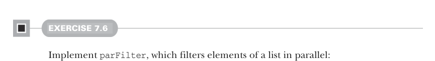

# Page 0187

[<- Page 0186](./page-0186) | [Pages index](./) | [Page 0188 ->](./page-0188)

> Part 2: Functional design and combinator libraries / Chapter 7: Purely functional parallelism / 7.3 The algebra of an API



#### EXERCISE 7.6

Implement `parFilter`, which filters elements of a list in parallel:

```scala
def parFilter[A](as: List[A])(f: A => Boolean): Par[List[A]]
```

Can you think of any other useful functions to write? Experiment with writing a few parallel computations of your own to see which ones can be expressed without additional primitives. Here are some ideas to try:

Is there a more general version of the parallel summation function we wrote at the beginning of this chapter? Try using it to find the maximum value of an `IndexedSeq` in parallel.

Write a function that takes a list of paragraphs (a `List[String]`) and returns the total number of words across all paragraphs in parallel. Look for ways to generalize this function.

Implement `map3`, `map4`, and `map5` in terms of `map2`.

### 7.3 The algebra of an API

As the previous section demonstrates, we often get far just by writing down the type signature for an operation we want and then following the types to an implementation. When working this way, we can almost forget the concrete domain (for instance, when we implemented `map` in terms of `map2` and `unit`) and just focus on lining up types. This isn’t cheating; it’s a natural style of reasoning, analogous to the reasoning one does when simplifying an algebraic equation. We’re treating the API as an *algebra*6

or an abstract set of operations, along with a set of *laws* or properties we assume to be true, and simply doing formal symbol manipulation following the rules specified by this algebra. Up until now, we’ve been reasoning somewhat informally about our API. There’s nothing wrong with this, but it can be helpful to take a step back and formalize what laws you expect to hold (or would like to hold) for your API.7 Without realizing it, you’ve probably mentally built up a model of what properties or laws you expect. Actually writing these down and making them precise can highlight design choices that wouldn’t be otherwise apparent when reasoning informally.

6 We do mean *algebra* in the mathematical sense of one or more sets, together with a collection of functions operating on objects of these sets, and a set of *axioms*. Axioms are statements assumed to be true from which we can derive other theorems that must also be true. In our case, the sets are particular types like `Par[A]` and `List[Par[A]]`, and the functions are operations like `map2`, `unit`, and `sequence`. 7 We’ll have much more to say about this throughout the rest of the book. In the next chapter, we’ll design a declarative testing library that lets us define properties we expect functions to satisfy and automatically generates test cases to check these properties. In part 3, we’ll introduce abstract interfaces specified only by sets of laws.

[<- Page 0186](./page-0186) | [Pages index](./) | [Page 0188 ->](./page-0188)
