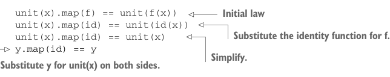
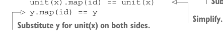

# Page 0189

[<- Page 0188](./page-0188) | [Pages index](./) | [Page 0190 ->](./page-0190)

> Part 2: Functional design and combinator libraries / Chapter 7: Purely functional parallelism / 7.3 The algebra of an API / 7.3.2 The law of forking



```scala
unit(x).map(f) == unit(f(x))
unit(x).map(id) == unit(id(x))
unit(x).map(id) == unit(x)
y.map(id) == y
```

> Initial law

> Substitute the identity function for f.



> Simplify. Substitute y for unit(x) on both sides.

Fascinating! Our new, simpler law talks only about `map`; apparently, the mention of `unit` was an extraneous detail. To get some insight into what this new law is saying, let’s think about what `map` can’t do. It can’t, say, throw an exception and crash the computation before applying the function to the result (can you see why this violates the law?). All it can do is apply the function `f` to the result of `y`, which, of course, leaves `y` unaffected when that function is `id`.11 Even more interestingly, given `y.map(id)` `==` `y`, we can perform the substitutions in the other direction to get back our original, more complex law. (Try it!) Logically, we have the freedom to do so because `map` can’t possibly behave differently for different function types it receives. Thus, given `y.map(id)` `==` `y`, it must be true that `unit(x).map(f)` `==` `unit(f(x))`. Since we get this second law or theorem for free, simply because of the parametricity of `map`, it’s sometimes called a *free theorem*.12


#### EXERCISE 7.7

*Hard*: Given `y.map(id)` `==` `y`, `y.map(g).map(f)` `==` `y.map(f` `compose` `g)` is a free theorem. (This is sometimes called *map fusion*, and it can be used as an optimization; rather than spawning a separate parallel computation to compute the second mapping, we can fold it into the first mapping.)13 Can you prove it?

### 7.3.2 The law of forking As interesting as all this is, this particular law doesn’t do much to constrain our implementation. You’ve probably been assuming these properties without even realizing it (it would be strange to have any special cases in the implementations of map, unit, or ExecutorService.submit or have map randomly throwing exceptions). Let’s consider a stronger property—fork should not affect the result of a parallel computation:


```scala
fork(x) == x,
```

11We say that `map` is required to be *structure-preserving* in that it doesn’t alter the structure of the parallel computation, only the value inside the computation. 12The idea of free theorems was introduced by Philip Wadler in his classic paper “Theorems for Free!” (http://mng.bz/Z9f1). 13Our representation of `Par` doesn’t give us the ability to implement this optimization, since it’s an opaque function. For example, `y.map(g)` returns a new `Par` that’s a black box—when we then call `.map(f)` on that result, we’ve lost the knowledge of the parts that were used to construct `y.map(g)`: namely, `y`, `map`, and `g`. All we see is the opaque function and, hence, cannot extract out `g` to compose with `f`. If `Par` were reified as a data type (e.g., an enumeration of various operations), then we could pattern match and discover opportunities to apply this rule. You may want to try experimenting with this idea on your own.

[<- Page 0188](./page-0188) | [Pages index](./) | [Page 0190 ->](./page-0190)
