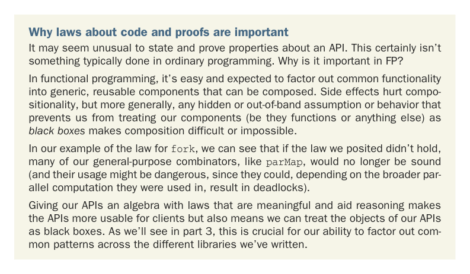

# Page 0190

[<- Page 0189](./page-0189) | [Pages index](./) | [Page 0191 ->](./page-0191)

> Part 2: Functional design and combinator libraries / Chapter 7: Purely functional parallelism / 7.3 The algebra of an API / 7.3.3 Breaking the law: A subtle bug

## 161 7.3 The algebra of an API

This seems like it should obviously be true of our implementation, and it is clearly a desirable property, consistent with our expectation of how `fork` should work. `fork(x)` should do the same thing as `x` but asynchronously—in a logical thread separate from the main thread. If this law didn’t always hold, then we’d have to somehow know when it was safe to call without changing meaning, without any help from the type system. Surprisingly, this simple property places strong constraints on our implementation of `fork`. After you’ve written down a law like this, take off your implementer hat, put on your debugger hat, and try to break your law. Think through any possible corner cases, try to come up with counterexamples, and even construct an informal proof that the law holds—at least thoroughly enough to convince a skeptical fellow programmer.

### 7.3.3 Breaking the law: A subtle bug Let’s try this mode of thinking. We’re expecting fork(x) == x for all choices of x and any choice of ExecutorService. We have a good sense of what x could be; it’s some expression making use of fork, unit, and map2 (and other combinators derived from these). What about ExecutorService? What are some possible implementations of it? There’s a good listing of different implementations in the class java.util.concurrent.Executors (see the API for more information: http://mng.bz/urQd).

#### EXERCISE 7.8

*Hard*: Look through the various static methods in `Executors` to get a feel for the different implementations of `ExecutorService` that exist. Then, before continuing, go back and revisit your implementation of `fork`, and try to find a counterexample or convince yourself that the law holds for your implementation.

Why laws about code and proofs are important It may seem unusual to state and prove properties about an API. This certainly isn’t something typically done in ordinary programming. Why is it important in FP?

In functional programming, it’s easy and expected to factor out common functionality into generic, reusable components that can be composed. Side effects hurt compositionality, but more generally, any hidden or out-of-band assumption or behavior that prevents us from treating our components (be they functions or anything else) as *black boxes* makes composition difficult or impossible.

In our example of the law for `fork`, we can see that if the law we posited didn’t hold, many of our general-purpose combinators, like `parMap`, would no longer be sound (and their usage might be dangerous, since they could, depending on the broader parallel computation they were used in, result in deadlocks).

Giving our APIs an algebra with laws that are meaningful and aid reasoning makes the APIs more usable for clients but also means we can treat the objects of our APIs as black boxes. As we’ll see in part 3, this is crucial for our ability to factor out common patterns across the different libraries we’ve written.

[<- Page 0189](./page-0189) | [Pages index](./) | [Page 0191 ->](./page-0191)
