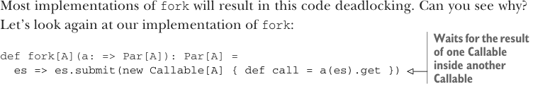

# Page 0191

[<- Page 0190](./page-0190) | [Pages index](./) | [Page 0192 ->](./page-0192)

> Part 2: Functional design and combinator libraries / Chapter 7: Purely functional parallelism / 7.3 The algebra of an API / 7.3.3 Breaking the law: A subtle bug

There’s actually a rather subtle problem that will occur in most implementations of `fork`. When using an `ExecutorService` backed by a thread pool of bounded size (see `Executors.newFixedThreadPool`), it’s very easy to run into a deadlock.14 Suppose we have an `ExecutorService` backed by a thread pool, where the maximum number of threads is 1. Try running the following example using our current implementation:

```scala
val a = lazyUnit(42 + 1)
val es = Executors.newFixedThreadPool(1)
println(Par.equal(es)(a, fork(a)))
```

Most implementations of `fork` will result in this code deadlocking. Can you see why? Let’s look again at our implementation of `fork`:



> Waits for the result of one Callable inside another Callable

```scala
def fork[A](a: => Par[A]): Par[A] =
es => es.submit(new Callable[A] { def call = a(es).get })
```

Note that we’re submitting the `Callable` first, and within that`Callable` we’re submitting another `Callable` to the `ExecutorService` and blocking on its result (recall that `a(es)` will submit a `Callable` to the `ExecutorService` and get back a `Future`). This is a problem if our thread pool has size `1`. The outer `Callable` gets submitted and picked up by the sole thread; within that thread, before it will complete, we submit and block waiting for the result of another `Callable`, but there are no threads available to run this `Callable`. They’re waiting on each other, and therefore our code deadlocks.


#### EXERCISE 7.9

*Hard*: Show that any fixed-size thread pool can be made to deadlock given this implementation of `fork`.

When you find counterexamples like this, you have two choices: you can try to fix your implementation such that the law holds, or you can refine your law a bit to state more explicitly the conditions under which it holds (you could simply stipulate that you require thread pools that can grow unbounded). Even this is a good exercise; it forces you to document invariants or assumptions that were previously implicit. Can we fix `fork` to work on fixed-size thread pools? Let’s look at a different implementation:

```scala
def fork[A](fa: => Par[A]): Par[A] =
es => fa(es)
```

14In the next chapter, we’ll write a combinator library for testing that can help discover problems like these automatically.

[<- Page 0190](./page-0190) | [Pages index](./) | [Page 0192 ->](./page-0192)
