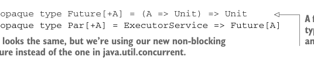

# Page 0192

[<- Page 0191](./page-0191) | [Pages index](./) | [Page 0193 ->](./page-0193)

> Part 2: Functional design and combinator libraries / Chapter 7: Purely functional parallelism / 7.3 The algebra of an API / 7.3.4 A fully non-blocking Par implementation using actors

## 163 7.3 The algebra of an API

This certainly avoids deadlock. The only problem is that we aren’t actually forking a separate logical thread to evaluate `fa`. So `fork(hugeComputation)(es)` for some `ExecutorService` `es` would run `hugeComputation` in the main thread, which is exactly what we wanted to avoid by calling `fork`. This is still a useful combinator, though, since it lets us delay instantiation of a computation until it’s actually needed. Let’s give it the name`delay`:

```scala
def delay[A](fa: => Par[A]): Par[A] =
es => fa(es)
```

But we’d really like to be able to run arbitrary computations over fixed-size thread pools. To do that, we’ll need to pick a different representation of `Par`.

### 7.3.4 A fully non-blocking Par implementation using actors

In this section, we’ll develop a fully non-blocking implementation of `Par` that works for fixed-size thread pools. Since this isn’t essential to our overall goals of discussing various aspects of functional design, you may skip to the next section if you prefer. Otherwise, read on. The essential problem with the current representation is that we can’t get a value out of a `Future` without the current thread blocking on its `get` method. A representation of `Par` that doesn’t leak resources this way has to be *non-blocking* in the sense that the implementations of `fork` and `map2` must never call a method that blocks the current thread like `Future.get`. Writing such an implementation correctly can be challenging. Fortunately, we have our laws with which to test our implementation, and we only need to get it right *once*. After that, the users of our library can enjoy a composable and abstract API that does the right thing every time. In the code that follows, you don’t need to understand exactly what’s going on with every part of it. We just want to show you, using real code, what a correct representation of `Par` that respects the laws might look like.

THE BASIC IDEA How can we implement a non-blocking representation of `Par`? The idea is simple. Instead of turning a `Par` into a `java.util.concurrent.Future` we can get a value out of (which requires blocking), we’ll introduce our own version of `Future`, with which we can register a callback that will be invoked when the result is ready. This is a slight shift in perspective:




```scala
opaque type Future[+A] = (A => Unit) => Unit
opaque type Par[+A] = ExecutorService => Future[A]
```

> A function that takes a function of type A => Unit as an argument and returns Unit Par looks the same, but we’re using our new non-blocking Future instead of the one in java.util.concurrent.

Our `Par` type looks identical, except we’re now using our new version of `Future`, which has a different API than the one in `java.util.concurrent`. Rather than calling `get` to obtain the result from our `Future`, our `Future` is an opaque type encapsulating

[<- Page 0191](./page-0191) | [Pages index](./) | [Page 0193 ->](./page-0193)
