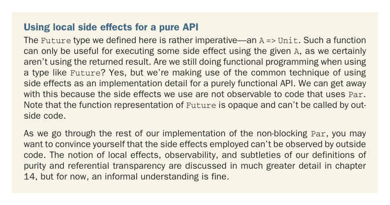
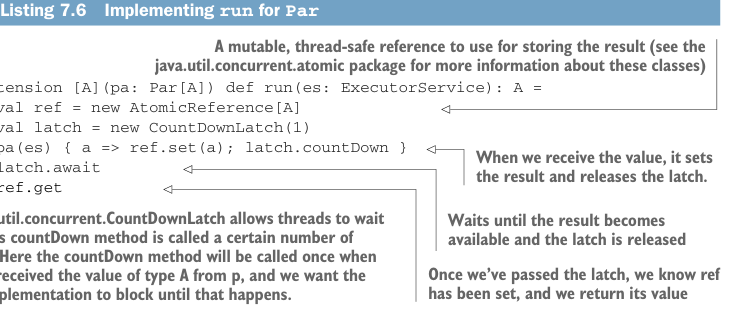

# Page 0193

[<- Page 0192](./page-0192) | [Pages index](./) | [Page 0194 ->](./page-0194)

> Part 2: Functional design and combinator libraries / Chapter 7: Purely functional parallelism / 7.3 The algebra of an API / 7.3.4 A fully non-blocking Par implementation using actors

a function that receives another function—one that expects an `A` and returns a `Unit`. The `A` `=>` `Unit` function is sometimes called a *continuation* or a *callback*. With this encoding, when we apply an `ExecutorService` to the function representing a `Par[A]`, we get back a new function: `(A` `=>` `Unit)` `=>` `Unit`. We can then call that by passing a callback that handles the produced `A` value. Our callback will get invoked whenever the `A` is computed—not immediately.



Using local side effects for a pure API The `Future` type we defined here is rather imperative—an `A` `=>` `Unit`. Such a function can only be useful for executing some side effect using the given `A`, as we certainly aren’t using the returned result. Are we still doing functional programming when using a type like `Future`? Yes, but we’re making use of the common technique of using side effects as an implementation detail for a purely functional API. We can get away with this because the side effects we use are not observable to code that uses `Par`. Note that the function representation of `Future` is opaque and can’t be called by outside code.

As we go through the rest of our implementation of the non-blocking `Par`, you may want to convince yourself that the side effects employed can’t be observed by outside code. The notion of local effects, observability, and subtleties of our definitions of purity and referential transparency are discussed in much greater detail in chapter 14, but for now, an informal understanding is fine.

With this representation of `Par`, let’s look at how we might implement the `run` function first, which we’ll change to just return an `A`. Since it goes from `Par[A]` to `A`, it will have to construct a continuation and pass it to the `Future`.

Listing 7.6 Implementing `run` for `Par`



> A mutable, thread-safe reference to use for storing the result (see the java.util.concurrent.atomic package for more information about these classes)

```scala
extension [A](pa: Par[A]) def run(es: ExecutorService): A =
val ref = new AtomicReference[A]
val latch = new CountDownLatch(1)
pa(es) { a => ref.set(a); latch.countDown }
latch.await
ref.get
```

> When we receive the value, it sets the result and releases the latch.

> A java.util.concurrent.CountDownLatch allows threads to wait until its countDown method is called a certain number of times. Here the countDown method will be called once when we’ve received the value of type A from p, and we want the run implementation to block until that happens.

> Waits until the result becomes available and the latch is released

> Once we’ve passed the latch, we know ref has been set, and we return its value

It should be noted that `run` blocks the calling thread while waiting for the `latch`. It’s not possible to write an implementation of `run` that doesn’t block. Since it needs to return a value of type `A`, it needs to wait for that value to become available before it can return. For this reason, we want users of our API to avoid calling `run` until they

[<- Page 0192](./page-0192) | [Pages index](./) | [Page 0194 ->](./page-0194)
