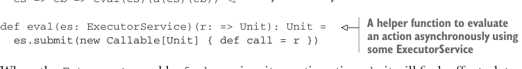

# Page 0194

[<- Page 0193](./page-0193) | [Pages index](./) | [Page 0195 ->](./page-0195)

> Part 2: Functional design and combinator libraries / Chapter 7: Purely functional parallelism / 7.3 The algebra of an API / 7.3.4 A fully non-blocking Par implementation using actors

## 165 7.3 The algebra of an API

want to wait for a result. We could even go so far as to remove `run` from our API altogether and expose the `apply` method on `Par` instead so users can register asynchronous callbacks. That would certainly be a valid design choice, but we’ll leave our API as it is for now. Let’s look at an example of creating a `Par`. The simplest one is `unit`:


> It simply passes the value to the continuation. Note that the ExecutorService isn’t needed.

```scala
def unit[A](a: A): Par[A] =
es => cb => cb(a)
```

Since `unit` already has a value of type `A` available, all it needs to do is call the continuation `cb`, passing it this value. If that continuation is the one from our `run` implementation, for example, this will release the latch and make the result available immediately. What about `fork`? This is where we introduce the actual parallelism:


> eval forks off the evaluation of a and returns immediately. The callback will be invoked asynchronously on another thread.

```scala
def fork[A](a: => Par[A]): Par[A] =
es => cb => eval(es)(a(es)(cb))
```



> A helper function to evaluate an action asynchronously using some ExecutorService

```scala
def eval(es: ExecutorService)(r: => Unit): Unit =
es.submit(new Callable[Unit] { def call = r })
```

When the `Future` returned by `fork` receives its continuation `cb`, it will fork off a task to evaluate the by-name argument `a`. Once the argument has been evaluated and called to produce a `Future[A]` we register `cb` to be invoked when that `Future` has its resulting `A`. What about `map2`? Recall the signature:

```scala
extension [A](pa: Par[A]) def map2[B, C](pb: Par[B])(f: (A, B) => C): Par[C]
```

Here a non-blocking implementation is considerably trickier. Conceptually, we’d like `map2` to run both `Par` arguments in parallel. When both results have arrived, we want to invoke `f` and then pass the resulting `C` to the continuation. But there are several race conditions to worry about here, and a correct non-blocking implementation is difficult using only the low-level primitives of `java.util.concurrent`.

A BRIEF INTRODUCTION TO ACTORS To implement `map2`, we’ll use a non-blocking concurrency primitive, called an *actor*. An `Actor` is essentially a concurrent process that doesn’t constantly occupy a thread. Instead, it only occupies a thread when it receives a message. Importantly, although multiple threads may be concurrently sending messages to an actor, the actor processes only one message at a time, queueing other messages for subsequent processing. This makes them useful as a concurrency primitive when writing tricky code that must be accessed by multiple threads and which would otherwise be prone to race conditions or deadlocks.

[<- Page 0193](./page-0193) | [Pages index](./) | [Page 0195 ->](./page-0195)
