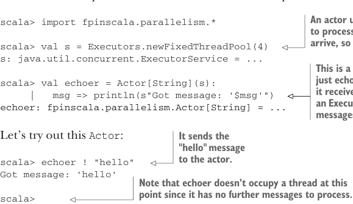

# Page 0195

[<- Page 0194](./page-0194) | [Pages index](./) | [Page 0196 ->](./page-0196)

> Part 2: Functional design and combinator libraries / Chapter 7: Purely functional parallelism / 7.3 The algebra of an API / 7.3.4 A fully non-blocking Par implementation using actors

It’s best to illustrate this with an example. Many implementations of actors would suit our purposes just fine, including the one in the popular Akka library (see https://github.com/akka/akka), but in the interest of simplicity, we’ll use our own minimal actor implementation included with the chapter code in the Actor.scala file:



> An actor uses an ExecutorService to process messages when they arrive, so we create one here.

```scala
scala> import fpinscala.parallelism.*
scala> val s = Executors.newFixedThreadPool(4)
s: java.util.concurrent.ExecutorService = ...
```

> This is a very simple actor that just echoes the String messages it receives. Note that we supply s, an ExecutorService, for processing messages.

```scala
scala> val echoer = Actor[String](s):
|
msg => println(s"Got message: '$msg'")
echoer: fpinscala.parallelism.Actor[String] = ...
```


Let’s try out this `Actor`:

> It sends the "hello" message to the actor.

```scala
scala> echoer ! "hello"
Got message: 'hello'
```

> Note that echoer doesn’t occupy a thread at this point since it has no further messages to process.

```scala
scala>
```

> It sends the “goodbye” message to the actor. The actor reacts by submitting a task to its ExecutorService to process that message.

```scala
scala> echoer ! "goodbye"
Got message: 'goodbye'
scala> echoer ! "You're just repeating everything I say, aren't you?"
Got message: 'You're just repeating everything I say, aren't you?'
```

It’s not at all essential to understand the `Actor` implementation. A correct, efficient implementation is rather subtle, but if you’re curious, see the Actor.scala file in the chapter code. The implementation is just under 100 lines of ordinary Scala code.15

IMPLEMENTING MAP2 VIA ACTORS We can now implement `map2` using an `Actor` to collect the result from both arguments. The code is straightforward, and there are no race conditions to worry about since we know the `Actor` will only process one message at a time.

Listing 7.7 Implementing `map2` with `Actor`

```scala
extension [A](p: Par[A]) def map2[B, C](p2: Par[B])(f: (A, B) => C): Par[C] =
es => cb =>
var ar: Option[A] = None
var br: Option[B] = None
// this implementation is a little too liberal in forking of threads -
// it forks a new logical thread for the actor and for stack-safety,
// forks evaluation of the callback `cb`
```


> Two mutable vars are used to store the two results.

15The main trickiness in an actor implementation has to do with the fact that multiple threads may be messaging the actor simultaneously. The implementation needs to ensure messages are processed one at a time as well as that all messages sent to the actor are processed eventually, rather than queued indefinitely. Even so, the code ends up being short.

[<- Page 0194](./page-0194) | [Pages index](./) | [Page 0196 ->](./page-0196)
