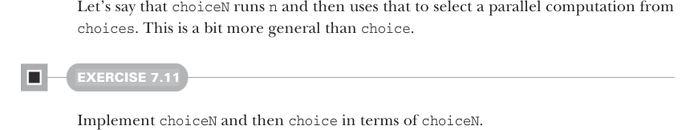
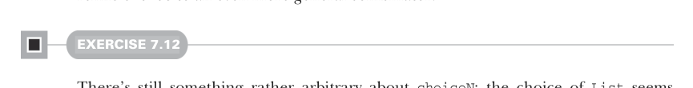

# Page 0198

[<- Page 0197](./page-0197) | [Pages index](./) | [Page 0199 ->](./page-0199)

> Part 2: Functional design and combinator libraries / Chapter 7: Purely functional parallelism / 7.4 Refining combinators to their most general form

## 169 7.4 Refining combinators to their most general form

But before we move on, let’s think about this combinator a bit. What is it doing? It’s running `cond`, and then when the result is available, it runs either `t` or `f`. This seems reasonable, but let’s see if we can think of some variations to understand the essence of this combinator. There’s something rather arbitrary about the fact that we are using `Boolean` and only selecting among *two* possible parallel computations, `t` and `f`, here. Why just two? If it’s useful to be able to choose between two parallel computations based on the results of a first, it should be useful to choose between *N* computations:

```scala
def choiceN[A](n: Par[Int])(choices: List[Par[A]]): Par[A]
```



Let’s say that `choiceN` runs `n` and then uses that to select a parallel computation from `choices`. This is a bit more general than `choice`.

#### EXERCISE 7.11

Implement `choiceN` and then `choice` in terms of `choiceN`.

Note what we’ve done so far; we’ve refined our original combinator, `choice`, to `choiceN`, which turns out to be more general and is capable of expressing `choice` as well as other use cases not supported by `choice`. But let’s keep going to see if we can refine `choice` to an even more general combinator.



#### EXERCISE 7.12

There’s still something rather arbitrary about `choiceN`: the choice of `List` seems overly specific. Why does it matter what sort of container we have? For instance, what if instead of a list of computations we have a `Map` of them?18

```scala
def choiceMap[K, V](key: Par[K])(choices: Map[K, Par[V]]): Par[V]
```

The `Map` encoding of the set of possible choices feels overly specific, just like `List`. If we look at our implementation of `choiceMap`, we can see we aren’t really using much of the API of `Map`. Really, the `Map[A,Par[B]]` is used to provide a function: `A` `=>` `Par[B]`. And now that we’ve spotted that, looking back at `choice` and `choiceN`, we can see that for `choice`, the pair of arguments was being used as a function of type `Bool-`ean` `=>` `Par[A]` (where the Boolean selects one of the two `Par[A]` arguments), and for

18`Map[K,V]` (see the API: http://mng.bz/eZ4l) is a purely functional data structure in the Scala standard library. It associates keys of type `K` with values of type `V` in a one-to-one relationship and allows us to look up the value by the associated key.

[<- Page 0197](./page-0197) | [Pages index](./) | [Page 0199 ->](./page-0199)
