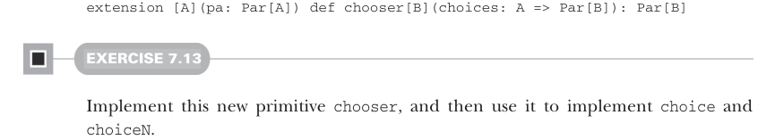

# Page 0199

[<- Page 0198](./page-0198) | [Pages index](./) | [Page 0200 ->](./page-0200)

> Part 2: Functional design and combinator libraries / Chapter 7: Purely functional parallelism / 7.4 Refining combinators to their most general form

`choiceN`, the list was being used as a function of type `Int` `=>` `Par[A]`! Let’s make a more general signature that unifies them all:



```scala
extension [A](pa: Par[A]) def chooser[B](choices: A => Par[B]): Par[B]
```

#### EXERCISE 7.13

Implement this new primitive `chooser`, and then use it to implement `choice` and `choiceN`.

Whenever you generalize functions like this, take a critical look at your generalized function when you’re finished. Although the function may have been motivated by some specific use case, the signature and implementation may have a more general meaning. In this case, `chooser` is perhaps no longer the most appropriate name for this operation, which is actually quite general—it’s a parallel computation that, when run, will run an initial computation whose result is used to determine a second computation. This second computation is not even required to exist before the first computation’s result is available. It doesn’t need to be stored in a container, like `List` or `Map`. Perhaps it’s being generated from whole cloth using the result of the first computation. This function, which comes up often in functional libraries, is usually called `bind` or `flatMap`:

```scala
extension [A](pa: Par[A]) def flatMap[B](f: A => Par[B]): Par[B]
```

Is `flatMap` really the most primitive possible function, or can we generalize further? Let’s play around with it a bit more. The name `flatMap` is suggestive of the fact that this operation could be decomposed into two steps: *mapping* `f:` `A` `=>` `Par[B]` over our `Par[A]`, which generates a `Par[Par[B]]`, and then *flattening* this nested `Par[Par[B]]` to a `Par[B]`. But this is interesting; it suggests all we needed to do was add an even simpler combinator—let’s call it `join`—for converting a `Par[Par[X]]` to `Par[X]` for any choice of `X`:

```scala
def join[A](ppa: Par[Par[A]]): Par[A]
```

Again, we’re just following the types. We have an example that demands a function with the given signature, so we bring it into existence. Now that it exists, we can think about what the signature means. We call it `join`, since conceptually, it’s a parallel computation that, when run, will execute the inner computation, wait for it to finish (much like `Thread.join`), and then return its result.

[<- Page 0198](./page-0198) | [Pages index](./) | [Page 0200 ->](./page-0200)
