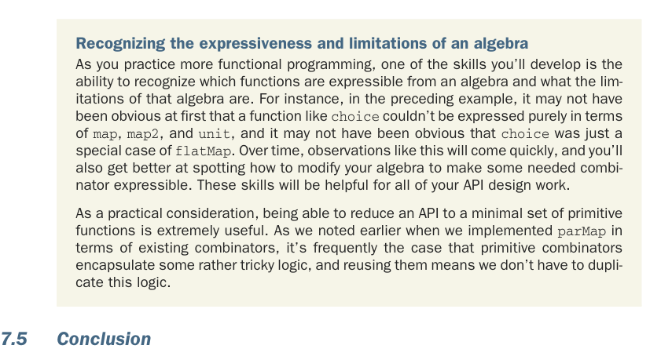

# Page 0200

[<- Page 0199](./page-0199) | [Pages index](./) | [Page 0201 ->](./page-0201)

> Part 2: Functional design and combinator libraries / Chapter 7: Purely functional parallelism / 7.5 Conclusion

## 171 7.5 Conclusion

#### EXERCISE 7.14

Implement `join`. Can you see how to implement `flatMap` using `join`? And can you implement `join` using `flatMap`?

We’ll stop here, but you’re encouraged to explore this algebra further. Try more complicated examples, discover new combinators, and see what you find! Here are some questions to consider:

Can you implement a function with the same signature as `map2` but using `flat-` `Map` and `unit`? How is its meaning different than that of `map2`?

Can you think of laws relating `join` to the other primitives of the algebra?

Are there parallel computations that can’t be expressed using this algebra? Can you think of any computations that can’t even be expressed by adding new primitives to the algebra?

Recognizing the expressiveness and limitations of an algebra As you practice more functional programming, one of the skills you’ll develop is the ability to recognize which functions are expressible from an algebra and what the limitations of that algebra are. For instance, in the preceding example, it may not have been obvious at first that a function like `choice` couldn’t be expressed purely in terms of `map`, `map2`, and `unit`, and it may not have been obvious that `choice` was just a special case of `flatMap`. Over time, observations like this will come quickly, and you’ll also get better at spotting how to modify your algebra to make some needed combinator expressible. These skills will be helpful for all of your API design work.

As a practical consideration, being able to reduce an API to a minimal set of primitive functions is extremely useful. As we noted earlier when we implemented `parMap` in terms of existing combinators, it’s frequently the case that primitive combinators encapsulate some rather tricky logic, and reusing them means we don’t have to duplicate this logic.

### 7.5 Conclusion

We’ve now completed the design of a library for defining parallel and asynchronous computations in a purely functional way. Although this domain is interesting, the primary goal of this chapter was to provide you with a window into the process of functional design, a sense of the sorts of problems you’re likely to encounter, and ideas about handling those problems. Chapters 4–6 had a strong theme of separation of concerns, specifically related to the idea of separating the description of a computation from the interpreter that then runs it. In this chapter, we saw that principle in action in the design of a library that

[<- Page 0199](./page-0199) | [Pages index](./) | [Page 0201 ->](./page-0201)
