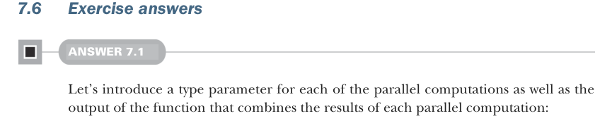

# Page 0201

[<- Page 0200](./page-0200) | [Pages index](./) | [Page 0202 ->](./page-0202)

> Part 2: Functional design and combinator libraries / Chapter 7: Purely functional parallelism / 7.6 Exercise answers

describes parallel computations as values of a data type `Par`, with a separate interpreter `run` to actually spawn the threads to execute them. In the next chapter, we’ll look at a completely different domain, take another meandering journey toward an API for that domain, and draw further lessons about functional design.

### Summary

No existing library is beyond reexamination. Most libraries contain arbitrary design choices. Experimenting with building alternative libraries may result in discovering new things about the problem space.

Simple examples let us focus on the essence of the problem domain instead of getting lost in incidental detail.

Parallel and asynchronous computations can be modeled in a purely functional way.

Building a description of a computation along with a separate interpreter that runs the computations allows computations to be treated as values, which can then be combined with other computations.

An effective technique for API design is conjuring types and implementations, trying to implement those types and implementations, adjusting, and iterating.

The `Par[A]` type describes a computation that may evaluate some or all of the computation on multiple threads.

 `Par` values can be transformed and combined with many familiar operations, such as `map`, `flatMap`, and `sequence`.

Treating an API as an algebra and defining laws that constrain implementations are both valuable design tools and an effective testing technique.

Partitioning an API into a minimal set of primitive functions and a set of combinator functions promotes reuse and understanding.

An actor is a non-blocking concurrency primitive based on message passing. Actors are not purely functional but can be used to implement purely functional APIs, as demonstrated with the implementation of `map2` for the nonblocking `Par`.



### 7.6 Exercise answers

#### ANSWER 7.1

Let’s introduce a type parameter for each of the parallel computations as well as the output of the function that combines the results of each parallel computation:

```scala
def map2[A, B, C](pa: Par[A], pb: Par[B])(f: (A, B) => C): Par[C]
```

[<- Page 0200](./page-0200) | [Pages index](./) | [Page 0202 ->](./page-0202)
