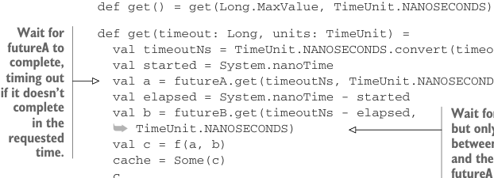

# Page 0202

[<- Page 0201](./page-0201) | [Pages index](./) | [Page 0203 ->](./page-0203)

> Part 2: Functional design and combinator libraries / Chapter 7: Purely functional parallelism / 7.6 Exercise answers

## 173 7.6 Exercise answers

Alternatively, we can define `map2` as an extension method on a `Par[A]`:


```scala
extension [A](pa: Par[A]) def map2[B, C](pb: Par[B])(f: (A, B) => C): Par[C]
```

#### ANSWER 7.2

The answer is discussed immediately after exercise 7.2.

#### ANSWER 7.3

Our original implementation of `map2` waited for both futures to complete before returning a `UnitFuture` with the final result. Before the caller ever sees a `Future`, we’ve waited for both of the constituent computations to complete! Instead of using `UnitFuture`, we’ll need to start the constituent computations and immediately return a composite `Future` that references them. The caller can then use the `get` overload with a timeout or any of the other methods on `Future`. To implement the timeout variant of `get`, we’ll need to call it on each of the futures we’ve started. We can await the first result using the supplied timeout and measure the amount of time it takes to complete. We can then await the second result, decrementing the timeout by the amount of time we waited for the first result:

```scala
extension [A](pa: Par[A])
def map2Timeouts[B, C](pb: Par[B])(f: (A, B) => C): Par[C] =
es => new Future[C]:
private val futureA = pa(es)
private val futureB = pb(es)
@volatile private var cache: Option[C] = None
```


> When the future is created, we immediately start the constituent computations.

```scala
def isDone = cache.isDefined
```



```scala
def get() = get(Long.MaxValue, TimeUnit.NANOSECONDS)
```

> Wait for futureA to complete, timing out if it doesn’t complete in the requested time.

```scala
def get(timeout: Long, units: TimeUnit) =
val timeoutNs = TimeUnit.NANOSECONDS.convert(timeout, units)
val started = System.nanoTime
val a = futureA.get(timeoutNs, TimeUnit.NANOSECONDS)
val elapsed = System.nanoTime - started
val b = futureB.get(timeoutNs - elapsed,
➥ TimeUnit.NANOSECONDS)
val c = f(a, b)
cache = Some(c)
c
```


> Wait for futureB to complete, but only wait for the difference between the requested timeout and the elapsed time waiting on futureA completion.

```scala
def isCancelled = futureA.isCancelled || futureB.isCancelled
def cancel(evenIfRunning: Boolean) =
futureA.cancel(evenIfRunning) || futureB.cancel(evenIfRunning)
```

[<- Page 0201](./page-0201) | [Pages index](./) | [Page 0203 ->](./page-0203)
