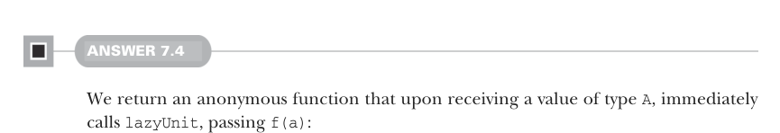
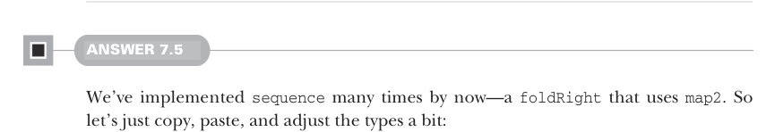

# Page 0203

[<- Page 0202](./page-0202) | [Pages index](./) | [Page 0204 ->](./page-0204)

> Part 2: Functional design and combinator libraries / Chapter 7: Purely functional parallelism / 7.6 Exercise answers



#### ANSWER 7.4

We return an anonymous function that upon receiving a value of type `A`, immediately calls `lazyUnit`, passing `f(a)`:

```scala
def asyncF[A, B](f: A => B): A => Par[B] =
a => lazyUnit(f(a))
```

Because the `lazyUnit` takes a by-name parameter, `f(a)` is not evaluated yet. To see why `lazyUnit(f(a))` implements the desired functionality, let’s incrementally substitute definitions:

```scala
a => lazyUnit(f(a))
a => fork(unit(f(a)))
a => es => es.submit(
new Callbable[B] { def run = unit(f(a))(es).get })
a => es => es.submit(
new Callbable[B] { def run = (es => UnitFuture(f(a)))(es).get })
a => es => es.submit(
new Callbable[B] { def run = UnitFuture(f(a)).get })
a => es => es.submit(
```

> Substitute lazyUnit.


> Substitute fork.

> Substitute unit.

> Apply es to es => UnitFuture(f(a)). Substitute UnitFuture#get.

```scala
new Callbable[B] { def run = f(a) })
```

We’re left with a function that receives an `A` and returns a `Par`, which submits a job to the executor that computes `f(a)` when run on an OS thread.



#### ANSWER 7.5

We’ve implemented `sequence` many times by now—a `foldRight` that uses `map2`. So let’s just copy, paste, and adjust the types a bit:

```scala
def sequence[A](pas: List[Par[A]]): Par[List[A]] =
pas.foldRight(unit(List.empty[A]))((pa, acc) => pa.map2(acc)(_ :: _))
```

We can do a bit better in this case, though, using a similar technique to the one we used in `sums`. Let’s divide the computation into two halves and compute each in parallel. Since we’ll again need efficient random access to the elements in our collection, we’ll first write a version that works with an `IndexedSeq[Par[A]]`:

```scala
def sequenceBalanced[A](pas: IndexedSeq[Par[A]]): Par[IndexedSeq[A]] =
if pas.isEmpty then unit(IndexedSeq.empty)
else if pas.size == 1 then pas.head.map(a => IndexedSeq(a))
else
val (l, r) = pas.splitAt(pas.size / 2)
sequenceBalanced(l).map2(sequenceBalanced(r))(_ ++ _)
```

[<- Page 0202](./page-0202) | [Pages index](./) | [Page 0204 ->](./page-0204)
